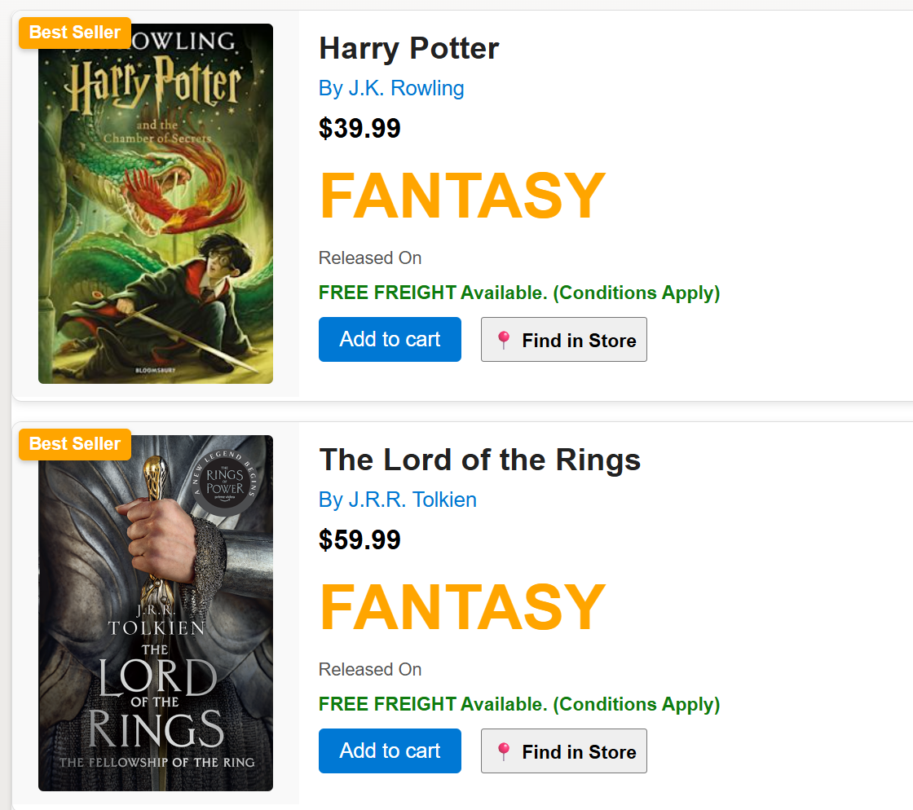

# Book Template Card Formatter

## Summary

This SharePoint JSON view formatting sample transforms your list items into visually rich book cards. Each card displays a book cover, title, author, price, category, release date, best seller badge, and more. It is ideal for book catalogues, libraries, or online bookstore lists.

## View requirements

### SharePoint List Columns

| Column Name      | Type                   | Description                                 |
|------------------|------------------------|---------------------------------------------|
| Title            | Single line of text    | Book title                                  |
| BookAuthor       | Single line of text    | Author of the book                          |
| BookAbstract     | Multiple lines of text | Short extract or summary of the book        |
| Category         | Single line of text    | Book category (e.g., Fantasy, Classic)      |
| Price            | Single line of text    | Price of the book                           |
| BookCoverUrl     | Single line of text    | URL to the book cover image                 |
| IsBestSeller     | Yes/No                 | Indicates if the book is a best seller      |
| ReleaseDate      | Date and Time          | Book release date                           |
| FindInStoreUrl   | Single line of text    | Link to find the book in a store (e.g., map)|
| AddToCart        | Yes/No                 | Add to cart flag                            |

> [!NOTE]
> - When using an external image URL in the `BookCoverUrl` column, the image may not be displayed. This happens when attempting to retrieve images from a domain that is not allowed. you'll need to configure the HTML Field Security settings. For more details, refer to [Allow or restrict the ability to embed content on SharePoint pages](https://support.microsoft.com/office/allow-or-restrict-the-ability-to-embed-content-on-sharepoint-pages-e7baf83f-09d0-4bd1-9058-4aa483ee137b).
> - A [PowerShell Script](./assets/Create%20List.ps1) is provided in the assets folder to provision the list and add sample data.
> - This script uses [PnP PowerShell](https://pnp.github.io/powershell/) and requires an environment ready for PnP PowerShell.

## Sample

Solution|Author
--------|---------
book-template.json | [Sudeep Ghatak](https://github.com/sudeepghatak) ([LinkedIn](https://www.linkedin.com/in/sudeepghatak/))

## Version history

Version|Date|Comments
-------|----|--------
1.0|Aug 31, 2025|Initial release

## Disclaimer
**THIS CODE IS PROVIDED *AS IS* WITHOUT WARRANTY OF ANY KIND, EITHER EXPRESS OR IMPLIED, INCLUDING ANY IMPLIED WARRANTIES OF FITNESS FOR A PARTICULAR PURPOSE, MERCHANTABILITY, OR NON-INFRINGEMENT.**

---

## Additional notes

- This sample includes a visually rich card layout for books, with best seller highlighting and store location links.

