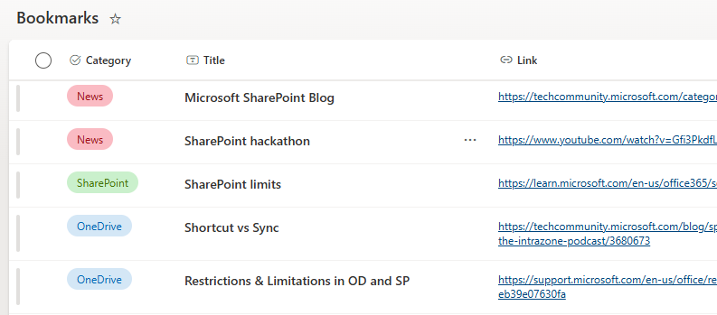
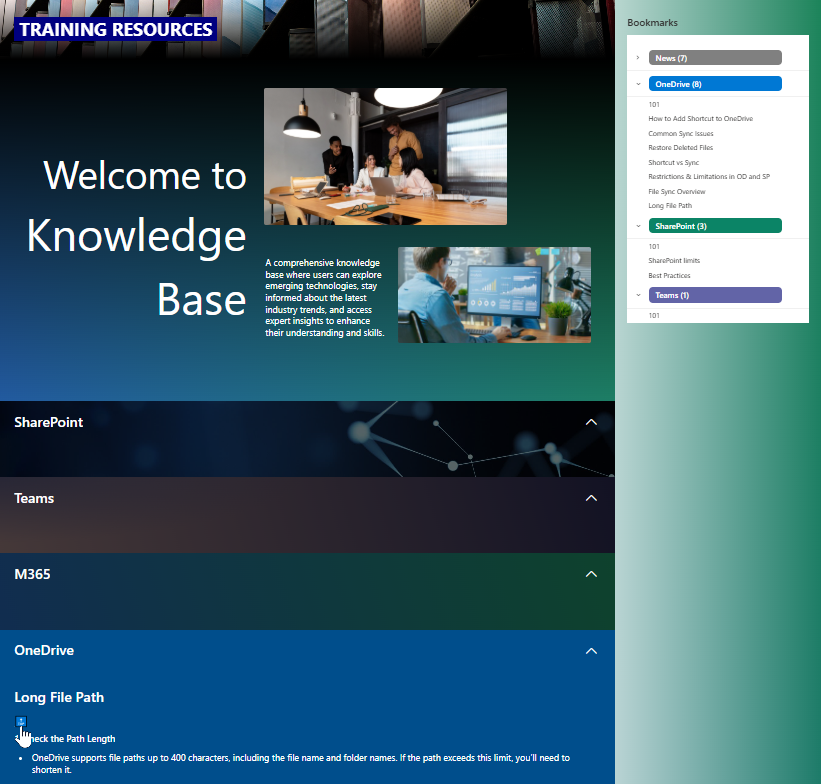

# Bookmarks

## Summary
This sample shows how to create SharePoint page bookmarks using list items with custom JSON formatting, inspired by [João Ferreira's post](https://sharepoint.handsontek.net/2024/10/14/create-custom-vertical-navigation-sharepoint-pages/).

**Features:**
1. Navigate to specific sections of a SharePoint page using heading styles (H2, H3,...) to generate anchor links
2. Open external links in a new tab (e.g https://google.com)
3. Group and filter content by category

## View requirements
Column Name|Required|Type
-----------|--------|-
Title      | Yes    | Text
Category   | Yes    | Choice
Link       | Yes    | Hyperlink

> [NOTE]
> It is necessary to group the view by the `Category` column.

## Sample

Solution|Author(s)
--------|-
bookmarks.json | [Watana](https://github.com/watana2)

## Version history
Version|Date|Comments
-------|----|-
1.0    | June 22, 2025 | Initial release

## Disclaimer
**THIS CODE IS PROVIDED *AS IS* WITHOUT WARRANTY OF ANY KIND, EITHER EXPRESS OR IMPLIED, INCLUDING ANY IMPLIED WARRANTIES OF FITNESS FOR A PARTICULAR PURPOSE, MERCHANTABILITY, OR NON-INFRINGEMENT.**

