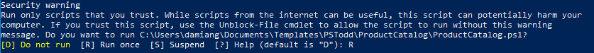
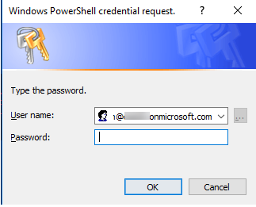
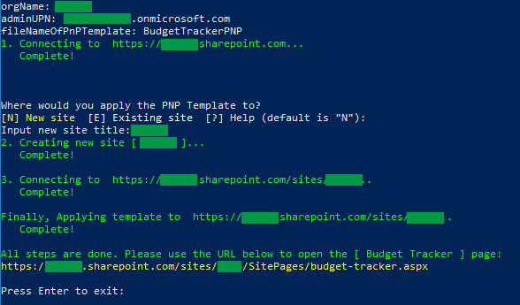
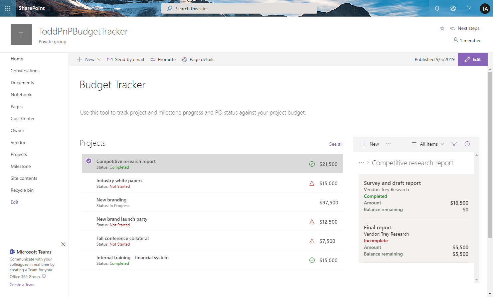

# Budget Tracker Installation

## Prerequisites

Install **PnP PowerShell modules** 

* **To install PnP PowerShell modules, open PowerShell as an administrator and run the following command:**  
   
  ``Install-Module SharePointPnPPowerShellOnline -AllowClobber``

## Deployment 
 
1. Open PowerShell as an administrator and go to the folder where the script is located. Then run the following command: 

   ``.\BudgetTracker.ps1``   
      
   **Notes**: 
   * Please make sure all files are downloaded, including the folder "**images**". 

   * Before the script will run, the following "**Security Warning**" may appear, type R to allow the script to run:

   

   * After entering the adminUPN you will be asked for the user password in a pop up window.
   
      
      
2. Please refer to the below table to enter the parameters:

| **Name**                      | **Value**                   | **Description**                                              |
| ----------------------------- | --------------------------- | ------------------------------------------------------------ |
| **orgName**                   | \<orgName\>                       | The name of the tenant.  For example:  If your SharePoint URL is http://contoso.sharepoint.com then your orgName is contoso.  |
| **adminUPN**                  | \<user\>@\<orgName\>.onmicrosoft.com | The site administrator account.                |
| **fileNameOfPnPTemplate** | BudgetTrackerPNP           | The file name of the **PnP Provisioning Template**.  |

3. Please choose if you would like to apply the PnP Template to existing site or a new site.

| **Name**                      | **Value**                   | **Description**                                              |
| ----------------------------- | --------------------------- | ------------------------------------------------------------ |
| **Input new site title**      | \<Site Title\>              | The title for the new site.                                  |
| **Input existing site url**   | \<Existing Site URL\> | The url of existing site.                |

After the script has successfully run you will see the following screen.

 

4. Copy the [Budget Tracker] URL.
 
5. Open a web broswer and navigate to the URL.
 
6. Select the first item in the Projects list and verify the page appears like this:

 