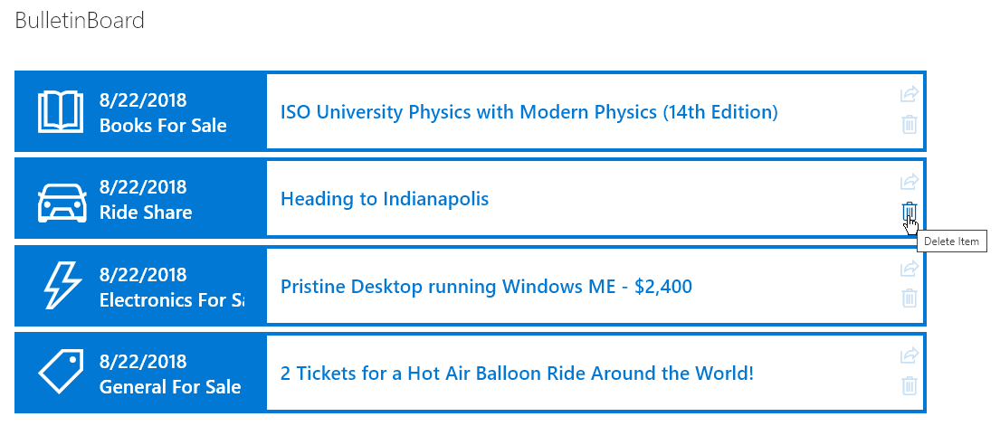

# Bulletin Board

## Summary
Provides an example of creating a simple bulletin board listing. The `rowFormatter` property is used to fully customize the display of rows to create a nice view of list items while easily allowing users to click on the item for additional details (see animation below). The large size and use of icons makes this much more attractive than a simple table view and keeps the functionality simple for users.

The view is sorted by the modified date descending (this is also the date that is shown with each item) so that new entries are always on top. The category is shown and is also used to provide an icon from the Office UI Fabric icons.

By using the Office UI Fabric color classes for themes, we can ensure our format looks good in all themes including both light and dark as well as custom themes.

## View requirements

|Type|Internal Name|Required|
|---|---|:---:|
|Single line of text|Title|Yes|
|Choice|Category|Yes|
|Multiple lines of text|Details||

## Bulletin Board with Buttons

An additional format, bulletin-board-format-with-buttons.json is provided that demonstrates adding additional buttons for sharing and deleting items. This is important because this sample removes item selection and this makes using this functionality difficult. By adding the buttons you can choose to provide this functionality while still taking advantage of the Bulletin Board format itself.

## Sample

Solution|Author(s)
--------|---------
bulletin-board.json | [Chris Kent](https://github.com/thechriskent) ([@thechriskent](https://twitter.com/thechriskent))
bulletin-board-with-buttons.json | [Chris Kent](https://github.com/thechriskent) ([@thechriskent](https://twitter.com/thechriskent))

## Version history

Version|Date|Comments
-------|----|--------
1.0|August 22, 2018|Initial release
1.1|May 20, 2020|Added a version with Buttons

## Disclaimer
**THIS CODE IS PROVIDED *AS IS* WITHOUT WARRANTY OF ANY KIND, EITHER EXPRESS OR IMPLIED, INCLUDING ANY IMPLIED WARRANTIES OF FITNESS FOR A PARTICULAR PURPOSE, MERCHANTABILITY, OR NON-INFRINGEMENT.**

---

## Additional notes

Using the `customRowAction` with an `action` of `defaultClick` creates a great way to make your list into a master view with details easily accessible. This sample wraps the entire row in a button so that you can click anywhere in the row to open the information panel for the item:

