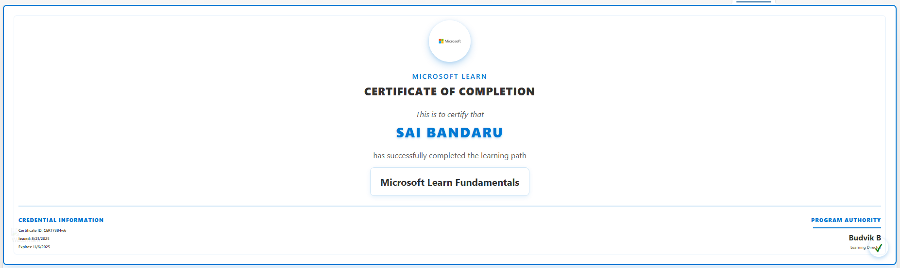

# Certificate Card Formatting

This sample uses **SharePoint List View Formatting** to display a **certificate-style card** for each employee.  
Each row in the list is transformed into a visually rich certificate layout, including logos, gradients, employee details, certification information, and program authority.

## View Requirements

Create a list with the following columns:

| Internal Name         | Type                     |
|-----------------------|--------------------------|
| **Title**             | Single line of text      |
| **EmployeeName**      | Single line of text      |
| **CertificationName** | Single line of text      |
| **CertificateID**     | Single line of text      |
| **IssueDate**         | Date and Time            |
| **ExpiryDate**        | Date and Time            |
| **HRManager**         | Single line of text      |

## Sample Data

| Title   | EmployeeName | CertificationName            | CertificateID | IssueDate           | ExpiryDate          | HRManager    |
|---------|--------------|-----------------------------|---------------|-------------------|-------------------|-------------|-------|
| Cert 1  | Sai Bandaru     | Microsoft Learn Fundamentals | CERT7884w6     | 2025-08-01T04:00:00Z | 2026-08-01T04:00:00Z | Budvik B  |

## How it Works

- Each row is displayed as a **certificate card** with a gradient border, logo, employee name, certification name, and details.
- **Employee Name** is highlighted with gradient text and uppercase letters.
- **Credential Information** (Certificate ID, Issue Date, Expiry Date) is shown on the bottom left.
- **Program Authority** (HR Manager) is shown on the bottom right with a signature line.
- Optional **watermark image** appears at the bottom-left of the certificate.
- A **checkmark badge** indicates successful completion.

## Sample

Solution|Author
--------|---------
certificate-card.json | [Sai Bandaru](https://github.com/saiiiiiii) ([LinkedIn](https://www.linkedin.com/in/sai-bandaru-97a946153/))

## Version history

Version|Date|Comments
-------|----|--------
1.0|August 26, 2025|Initial release

## Disclaimer

**THIS CODE IS PROVIDED *AS IS* WITHOUT WARRANTY OF ANY KIND, EITHER EXPRESS OR IMPLIED, INCLUDING ANY IMPLIED WARRANTIES OF FITNESS FOR A PARTICULAR PURPOSE, MERCHANTABILITY, OR NON-INFRINGEMENT.**

---

## Additional Notes

- Works best in **List view** with `EmployeeName` sorted ascending.
- You can adjust **logo, gradients, colors, and shadows** in the JSON to match your corporate branding.
- Compatible with **SharePoint Online Modern Lists**.  
