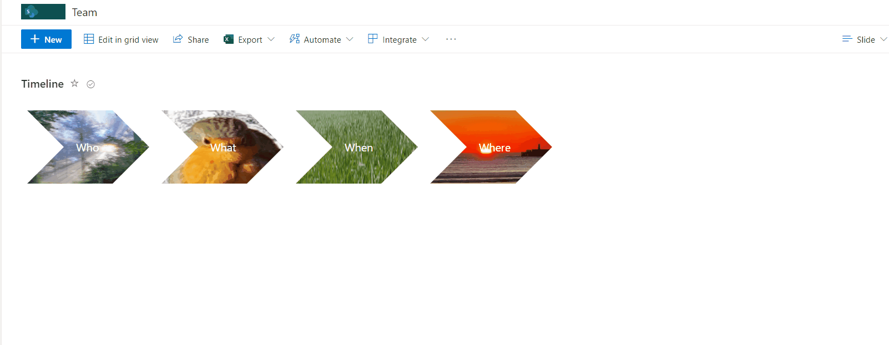

# Chevron shape format

## Summary
This sample how to create chevron style shape with background image. When mouse over image popups and display title and description.

## View requirements
- The format expect the following fields:

Field |Type
--------|---------
Title | Single line of text 
Description | Multiple line of text - Description of item
IMG | Image  - Background image

## Sample

Solution|Author(s)
--------|---------
chevron-shape-format.json | [André Lage](https://twitter.com/aaclage)

## Version history

Version|Date|Comments
-------|----|--------
1.0|April 14, 2022|Initial release

## Disclaimer
**THIS CODE IS PROVIDED *AS IS* WITHOUT WARRANTY OF ANY KIND, EITHER EXPRESS OR IMPLIED, INCLUDING ANY IMPLIED WARRANTIES OF FITNESS FOR A PARTICULAR PURPOSE, MERCHANTABILITY, OR NON-INFRINGEMENT.**

