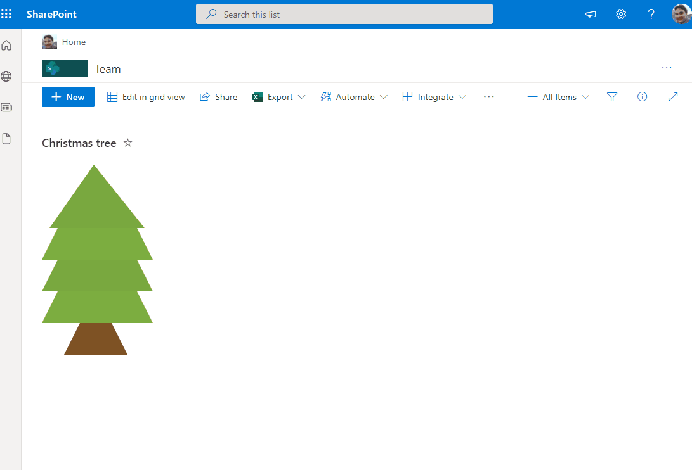

# Christmas Tree

## Summary
This sample draws a tree across rows in 3 different stages "**alt**" as top, "**body**" as tree and "**wood**" as bottom. You can also include icons in the tree. The **Title** field will appear as a tooltip on the icons.

**Christmas Tree with Presents** 

## View requirements
- The format expect the following fields:

Field |Type
--------|---------
Title | Single line of text 
Structure | Single line of text - The tree is composed by the following structure: "**alt**" - Header of Tree (**Triangle**), "**body**" - body of tree (**Trapezoid**) and "**wood**" - Base of Tree (**Smaller Trapezoid**)
color | Single line of text - (recommended colors for the tree **79a83f**, **7cad40**, **c19c00**. For the base of tree recommend color **7e5224**). PS: no need to include #
Gift |  Single line of text - icons of gifts (samples **GiftboxOpen**, **GiftCard**, **Giftbox**, **GiftBoxSolid** and **FavoriteStarFill** for top of tree, )
GiftSide | Single line of text - options "**Left**" or "**Right**"

### Edit View requirements

- Edit View where format will be included, access to "**Sort**" Area and select column "**Structure**" and check as **ascending order**, this option order tree correctly from top to bottom event when included new levels in the tree.

## Sample

Solution|Author(s)
--------|---------
christmas-tree.json | [André Lage](https://github.com/aaclage) ([@aaclage](https://twitter.com/aaclage))

## Version history

Version|Date|Comments
-------|----|--------
1.0|December 09, 2021|Initial release

## Disclaimer
**THIS CODE IS PROVIDED *AS IS* WITHOUT WARRANTY OF ANY KIND, EITHER EXPRESS OR IMPLIED, INCLUDING ANY IMPLIED WARRANTIES OF FITNESS FOR A PARTICULAR PURPOSE, MERCHANTABILITY, OR NON-INFRINGEMENT.**

