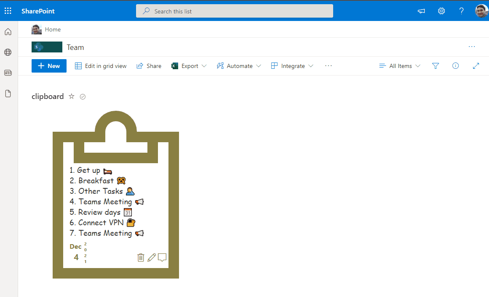

# Clipboards

## Summary
This sample demonstrates displaying items in a clipboard. Text that is too long is shown in an overflow custom hover panel.

## View requirements
- The format expect the following fields:

Field |Type
--------|---------
Title | Single line of text 
Description | Multiple line of text - Content of clipboard
DueDate | Date & Time - this field will be used to order the clipboards

> Before apply the format to the view, sort the items by `DueDate` descending.

## Sample

Solution|Author(s)
--------|---------
clipboards.json | [André Lage](https://github.com/aaclage)

## Version history

Version|Date|Comments
-------|----|--------
1.0|December 06, 2021|Initial release

## Disclaimer
**THIS CODE IS PROVIDED *AS IS* WITHOUT WARRANTY OF ANY KIND, EITHER EXPRESS OR IMPLIED, INCLUDING ANY IMPLIED WARRANTIES OF FITNESS FOR A PARTICULAR PURPOSE, MERCHANTABILITY, OR NON-INFRINGEMENT.**

