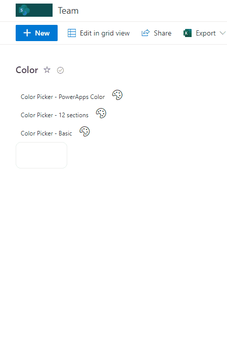
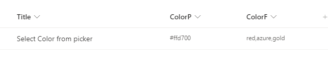

# Color Picker

## Summary

This sample contains pre defined palettes of color as listed here: [color enumeration in Power Apps](https://docs.microsoft.com/en-us/powerapps/maker/canvas-apps/functions/function-colors). These palettes are then made available as a color picker setting the value on selection. 2 additional color palettes, **"12 sections"** and **"Basic"**, are also provided as separate formats.

## Main sample (color-picker.json)

This format allow users to select up to 140 colors existing in Power Apps, it's also possible to select what colors can be displayed using the field `ColorF` as filter and include only the names of the colors you wish to include. Fot instance: `red,azure,gold`.

> If `ColorF` is empty then all 140 colors are displayed. 

## View requirements
- The format expect the following fields:

Field |Type
--------|---------
Title | Single line of text 
ColorP | Single lines of text
ColorF | Single lines of text

## Sample

Solution|Author(s)
--------|---------
color-picker.json | [André Lage](https://github.com/aaclage) ([@aaclage](https://twitter.com/aaclage))
color-picker-12Sections-palette.json | [André Lage](https://github.com/aaclage) ([@aaclage](https://twitter.com/aaclage))
color-picker-basic-palette.json | [André Lage](https://github.com/aaclage) ([@aaclage](https://twitter.com/aaclage))

## Version history

Version|Date|Comments
-------|----|--------
1.0|January 17, 2022|Initial release

## Disclaimer

**THIS CODE IS PROVIDED *AS IS* WITHOUT WARRANTY OF ANY KIND, EITHER EXPRESS OR IMPLIED, INCLUDING ANY IMPLIED WARRANTIES OF FITNESS FOR A PARTICULAR PURPOSE, MERCHANTABILITY, OR NON-INFRINGEMENT.**

---

## Additional notes
None

