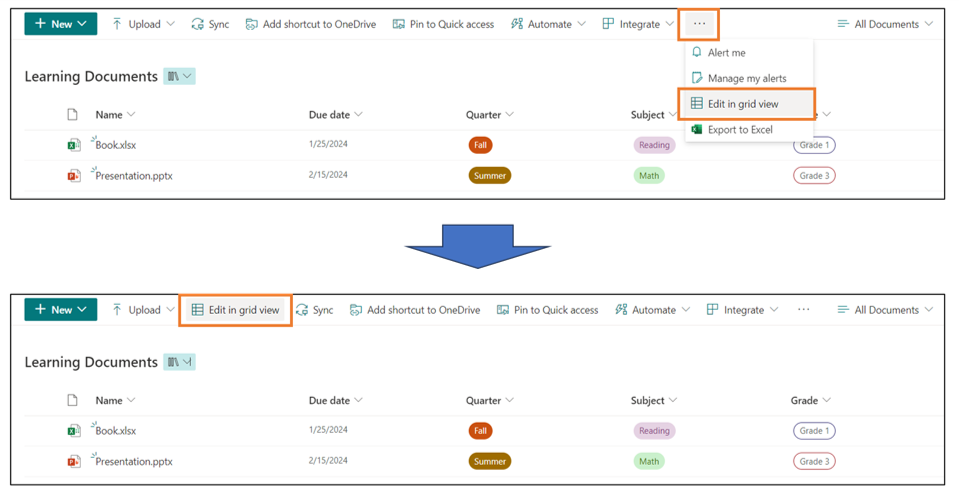
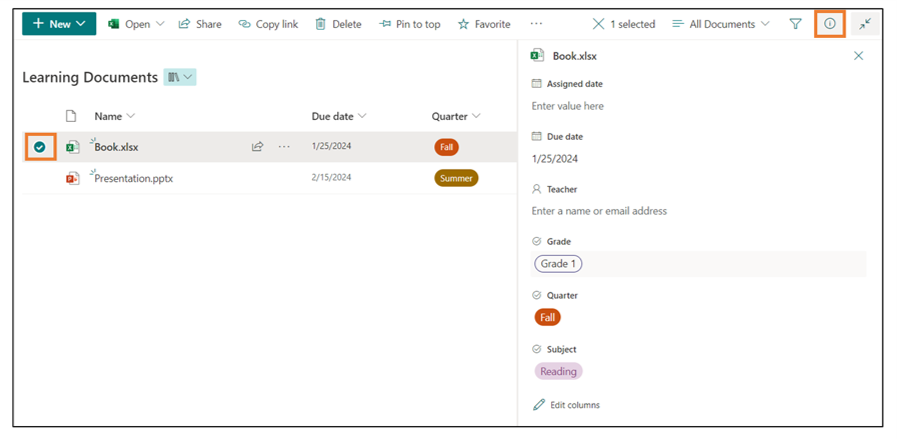
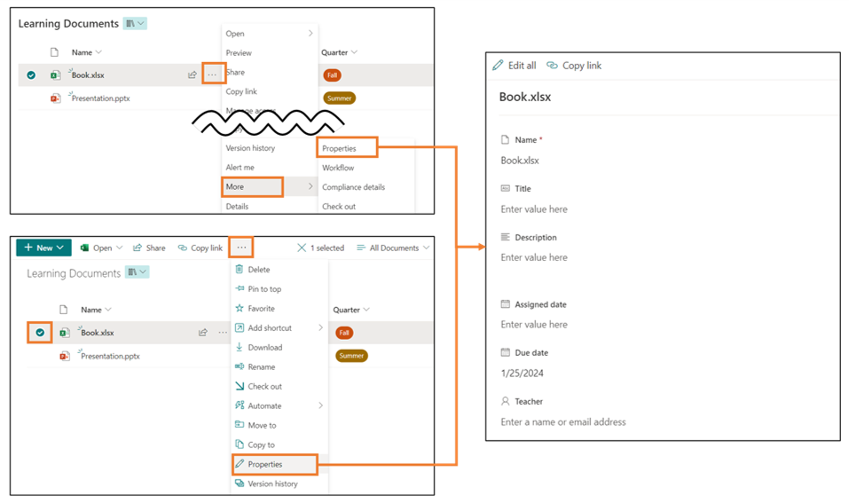

# Display Edit in Grid View Button in the Command Bar

## Summary

In the Document Library, the [Edit in grid view] button is hidden under the [...] button. This sample demonstrates displaying the [Edit in grid view] button on the command bar. By displaying the [Edit in grid view] button on the command bar, you can quickly open the grid view and edit the file property values.

## View requirements

This can be applied to any view.

## Sample

Solution|Author(s)
--------|---------
commandbar-display-edit-in-gridview.json| [Tetsuya Kawahara](https://github.com/tecchan1107) ([@techan_k](https://twitter.com/techan_k))

## Version history

Version |Date             |Comments
--------|-----------------|--------------------------------
1.0     |January 23, 2024 |Initial release

## Disclaimer
**THIS CODE IS PROVIDED *AS IS* WITHOUT WARRANTY OF ANY KIND, EITHER EXPRESS OR IMPLIED, INCLUDING ANY IMPLIED WARRANTIES OF FITNESS FOR A PARTICULAR PURPOSE, MERCHANTABILITY, OR NON-INFRINGEMENT.**

---

## Additional notes

- [Command bar customization syntax reference](https://learn.microsoft.com/sharepoint/dev/declarative-customization/view-commandbar-formatting)
- File property values can also be edited in ways other than grid view.

  

  

  If you frequently edit file property values in Grid View and want to edit them in Grid View right from the command bar, try using this sample.

