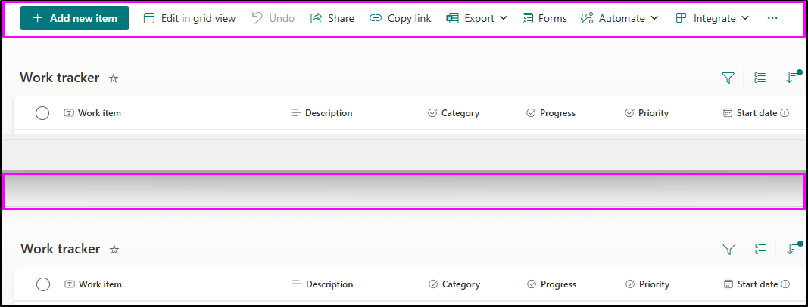
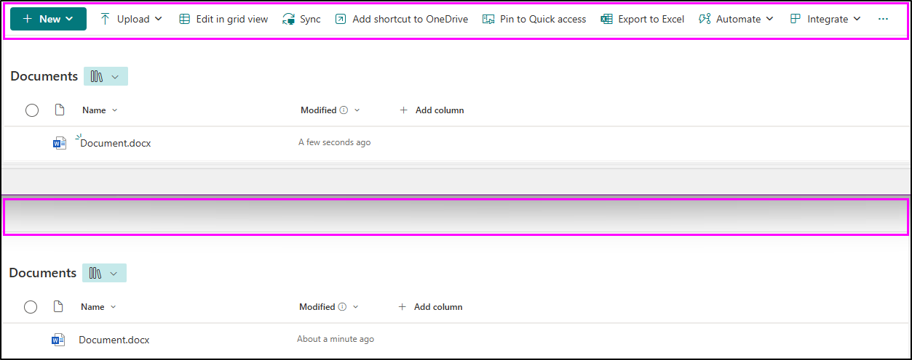

# Hide All Buttons on Command Bar

## Summary
Hide everything that can be hidden on the command bar. My use case was to embed a summary into a SharePoint page using an iFrame and keep things as clean as possible.

SharePoint Lists

SharePoint Document Library

## View requirements
- You'll want this to be it's own list view, so the hidden buttons aren't more difficult to access when you actually need them.

## Sample

Solution|Author(s)
--------|---------
commandbar-hide-all.json | [gitjego](https://github.com/gitjego) & [Watana](https://github.com/watana2)

## Version history

Version|Date|Comments
-------|----|--------
1.0|December 24, 2024|Initial release
1.1|May 3, 2025|Added/updated command bar props/images
1.2|June 28, 2025|Added `PublishCommand`, `properties`

## Disclaimer
**THIS CODE IS PROVIDED *AS IS* WITHOUT WARRANTY OF ANY KIND, EITHER EXPRESS OR IMPLIED, INCLUDING ANY IMPLIED WARRANTIES OF FITNESS FOR A PARTICULAR PURPOSE, MERCHANTABILITY, OR NON-INFRINGEMENT.**

---

## Additional notes
The buttons to be hidden must be explicitly named, and it is likely that there will be new buttons that need to be hidden in new releases from Microsoft. This code currently hides everything listed in Microsoft's [Documentation](https://learn.microsoft.com/sharepoint/dev/declarative-customization/view-commandbar-formatting). Refer to this if you are seeing commands not be hidden, and add a line as needed.
If you can find a way to hide the viewSelector, please pull request.  :)

