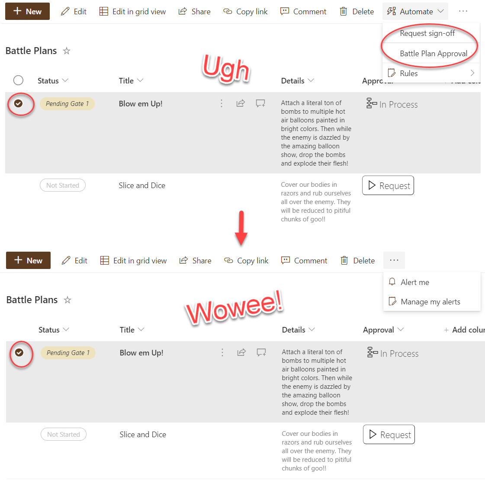
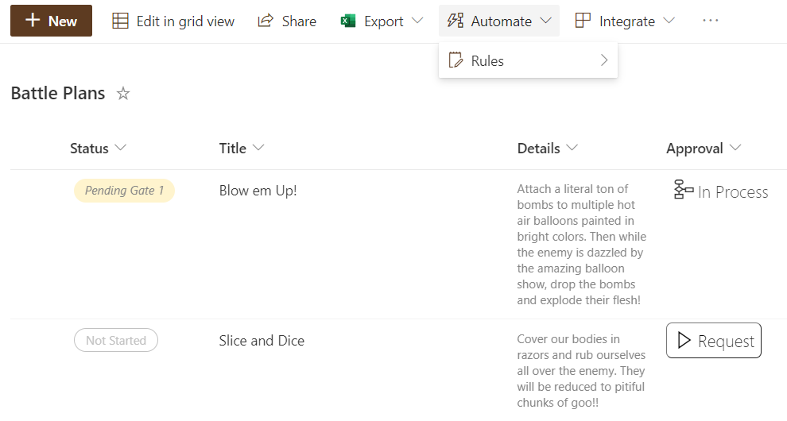

# Hide Automate Button in the CommandBar

## Summary
The Automate button in the CommandBar provides access to Rules as well as associated Power Automate flows for our list/library. However, there are times when we don't want the associated flows to be shown because we are providing flow launch buttons. Maybe we're conditionally picking which flow should run based on properties of an individual item or were customizing the flow run panel and the inclusion of these menu options would undermine that.

This sample only hides the Automate button when an item or items are selected. This ensures the Rules option remains available but prevents users from launching flows for a selected item using this menu.

Below you can see the flows being offered in the Automate menu when an item is selected. With the format applied that Automate menu no longer shows up on item selection:

Because we use the `selectionModes` property we are targeting our sample only to when items are selected meaning that even with the format applied, the Automate button is available when nothing is selected:

## View requirements

None, this can be applied to any view. This can also be combined with other view formats.

## Sample

Solution|Author(s)
--------|---------
commandbar-hide-automate | [Chris Kent](https://twitter.com/thechriskent)

## Version history

Version|Date|Comments
-------|----|--------
1.0|April 15, 2022|Initial release

## Disclaimer
**THIS CODE IS PROVIDED *AS IS* WITHOUT WARRANTY OF ANY KIND, EITHER EXPRESS OR IMPLIED, INCLUDING ANY IMPLIED WARRANTIES OF FITNESS FOR A PARTICULAR PURPOSE, MERCHANTABILITY, OR NON-INFRINGEMENT.**

---

## Additional notes

This sample works well with the [generic-flow-status](../../column-samples/generic-flow-status/) column format.

