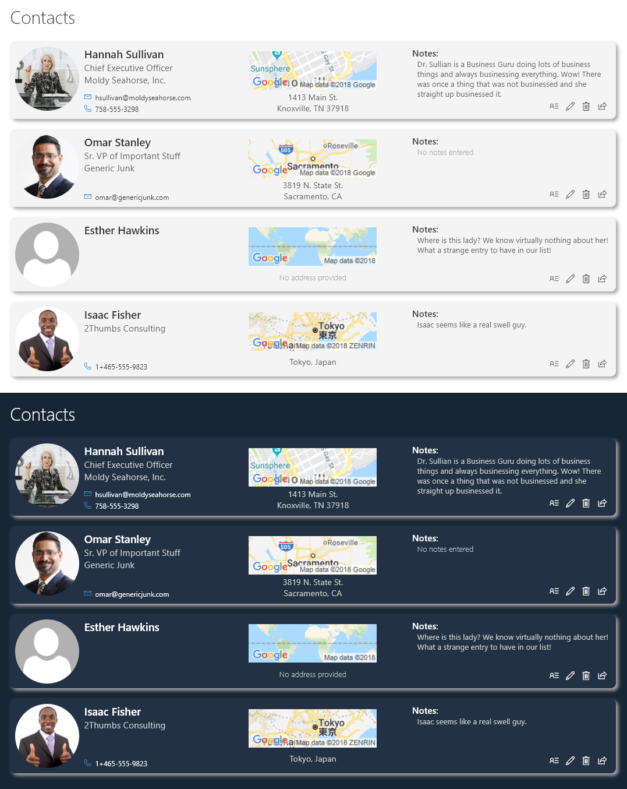
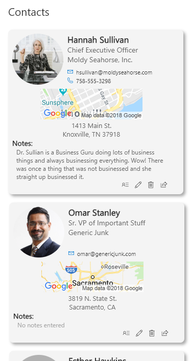

# Contact Card Row Format

## Summary
This is a sample of a complex format that customizes the entire display of a row. The goal is to illustrate several key principals including:
- Responsive layout through flexbox
- Conditionally showing elements based on fields having values
- Providing placeholders when fields are blank
- Row Actions
  - Opening the information panel (`defaultClick`)
  - Editing the list item (`editProps`)
  - Deleting the list item (`delete`)
  - Sharing the list item (`share`)
- Use of theme color classes to ensure the format displays as intended regardless of theme (light, dark, custom, etc.)
- Use of font size and weight classes to match O365 styles
- Integration of maps
- Disabling of selection (`hideSelection`)
- Removal of the list header (`hideListHeader`)

### Map API key

The key provided in the template (the ugly text after `&key`) should be changed to your own FREE API Key. This will ensure you don't receive errors from over usage of a shared key. Getting a key takes 2 minutes and is FREE: [Get API Key](https://developers.google.com/maps/documentation/static-maps/get-api-key)

>Note: Failure to switch the key to your own key leaves you open to future issues as other users use this key or if this key were to be revoked.

## View requirements

All fields below should be part of the view, but only those marked with Required need to have values:

|Type|Internal Name|Required|
|---|---|:---:|
|Single line of text|Title|Yes|
|Single line of text|JobTitle||
|Single line of text|Company||
|Single line of text|Email||
|Single line of text|Phone||
|Single line of text|StreetAddress||
|Single line of text|City||
|Single line of text|State||
|Single line of text|ZipCode||
|Hyperlink|Picture||
|Multiple lines of text|Notes||

## Sample

Solution|Author(s)
--------|---------
contact-card-format | [Chris Kent](https://twitter.com/thechriskent)

## Version history

Version|Date|Comments
-------|----|--------
1.0|August 22, 2018|Initial release

## Disclaimer
**THIS CODE IS PROVIDED *AS IS* WITHOUT WARRANTY OF ANY KIND, EITHER EXPRESS OR IMPLIED, INCLUDING ANY IMPLIED WARRANTIES OF FITNESS FOR A PARTICULAR PURPOSE, MERCHANTABILITY, OR NON-INFRINGEMENT.**

---

## Additional notes

This format takes advantage of CSS Flexbox to help make it responsive:

