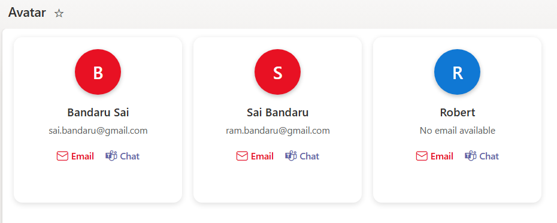

# SharePoint Column Formatting – Contact Custom Avatar Card

## Summary

This SharePoint column formatting sample provides a modern, interactive **Contact custom avatar card** for list items using JSON formatting. It enhances the display of user information and enables **quick actions** directly from the list. The column supports **Person or Group type fields for Email**, making it fully compatible with SharePoint user data.

---

## View Requirements

This formatting works for lists with the following fields:

| Field | Type | Description |
|-------|------|-------------|
| Email | Person or Group column | User’s email (must be of Person/Group type) |

---

## Key Features

### Custom Avatar
- Displays the **first letter of the user’s name** inside a circular avatar.
- **Dynamic background color**:
  - **Red (`#e81123`)** if the user has an email.
  - **Blue (`#1078D4`)** if no email is provided.
- Rounded circle with shadow and uppercase initials for visibility.

### Person/Email Integration
- Works with **Person or Group column type** to extract the user's email and display name.

### Quick Actions
- **Email icons** opens the default mail client with the user's email.
- **Teams icons** opens Microsoft Teams for direct conversation.

---

## Usage Instructions
1. Navigate to your **SharePoint list**.
2. Click All items → **Add view**.
3. Select **Gallery** as the layout and give it a name of your choice.
4. Open the new view → click **Format current view**.
3. Choose **Advanced mode** and paste the JSON sample into the formatting editor.
4. Save the formatting.

Your list will now display in a **Gallery (card-style) layout** with custom avatars and action buttons.

---

## Requirements
- **SharePoint Online (Modern Experience)**
- **Person or Group column type** for Email
- Modern browser for full functionality

---

## Sample

| Solution | Author |
|----------|--------|
| people-name-avatar.json | [Sai Bandaru](https://github.com/saiiiiiii) ([LinkedIn](https://www.linkedin.com/in/sai-bandaru-97a946153/)) |

## Version history

| Version | Date | Comments |
|---------|------|---------|
| 1.0 | August 25, 2025 | Initial release |

## Disclaimer
**THIS CODE IS PROVIDED *AS IS* WITHOUT WARRANTY OF ANY KIND, EITHER EXPRESS OR IMPLIED, INCLUDING ANY IMPLIED WARRANTIES OF FITNESS FOR A PARTICULAR PURPOSE, MERCHANTABILITY, OR NON-INFRINGEMENT.**

---
