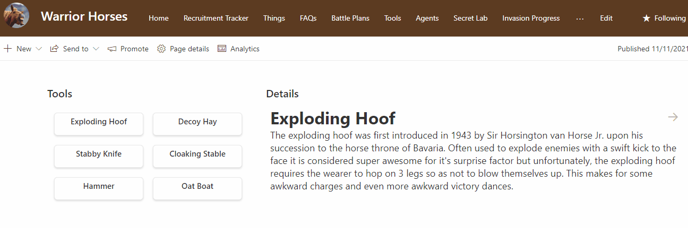

# Content Navigator

## Summary
This sample demonstrates the use of the `id` attribute to create linkable anchors. The list is intended to have 2 views (Content and Links) using the 2 view formats supplied. Each view can be added to a page as a separate list webpart. No connections are required. Clicking on an item in the links view webpart will navigate to the item in the content view webpart. Additionally, previous and next buttons are included in the content view for internal navigation.

The sample utilizes the `@rowIndex` magic string to generate the anchor links. This means that you can add additional items and the formats will continue to work as expected. The order is determined by the order of the views (which needs to be the same).

## View requirements

|Type|Internal Name|Required|
|---|---|:---:|
|Single line of text|Title|Yes|
|Multiple line of text|Content|Yes|

## Sample

Solution|Author(s)
--------|---------
content-navigator.json | [Chris Kent](https://twitter.com/theChrisKent)
content-navigator-links.json | [Chris Kent](https://twitter.com/theChrisKent)

## Version history

Version|Date|Comments
-------|----|--------
1.0|April 15, 2022|Initial release

## Disclaimer
**THIS CODE IS PROVIDED *AS IS* WITHOUT WARRANTY OF ANY KIND, EITHER EXPRESS OR IMPLIED, INCLUDING ANY IMPLIED WARRANTIES OF FITNESS FOR A PARTICULAR PURPOSE, MERCHANTABILITY, OR NON-INFRINGEMENT.**

---

