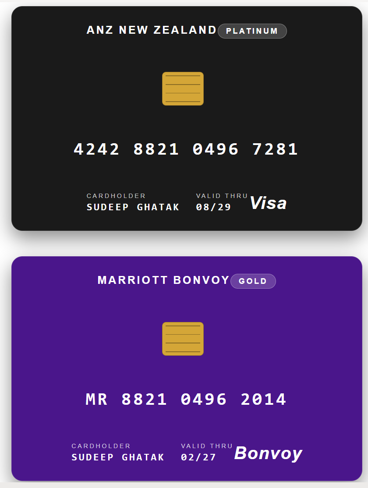

# Credit / Loyalty Card

## Summary

This SharePoint JSON view formatting sample transforms list items into realistic credit / loyalty cards. Each item renders as a plastic card with a brand name, tier pill, EMV chip, contactless symbol, embossed-style card number, cardholder name, expiry date, and a network logo. The card colour automatically adapts to the Tier value (Standard, Gold, Platinum, Black, Premium).

It's designed for member directories, partner programs, gym/hotel/airline loyalty rosters, and corporate-card registers.

## View requirements

### Recommended SharePoint List Columns

| Column Name   | Internal Name | Type                | Description                                                              |
| ------------- | ------------- | ------------------- | ------------------------------------------------------------------------ |
| Title         | Title         | Single line of text | Brand or issuing organisation (e.g. ANZ NEW ZEALAND, Marriott)           |
| Network       | Network       | Choice              | Network or label (Visa, Mastercard, Amex, Bonvoy, Les Mills, etc)        |
| Tier          | Tier          | Choice              | Tier (Standard, Gold, Platinum, Black, Premium)                          |
| Tier Color    | TierColor     | Single line of text | Hex colour for the card background (e.g. `#1a1a1a` for Black). See below |
| Card Number   | CardNumber    | Single line of text | Card number formatted with spaces (e.g. `4242 8821 0496 7281`)           |
| Card Holder   | CardHolder    | Single line of text | Cardholder full name (uppercase)                                         |
| Valid Thru    | ValidThru     | Single line of text | Expiry in `MM/YY` format (e.g. `08/29`)                                  |

A PowerShell script has been provided in the [assets](./assets/Create%20List.ps1) folder to provision the list for you.

**Note:** This script uses [PnP PowerShell](https://pnp.github.io/powershell/) and requires an environment ready for PnP PowerShell.

## Sample

Solution|Author
--------|---------
credit-card.json | [Sudeep Ghatak](https://github.com/sudeepghatak) ([LinkedIn](https://www.linkedin.com/in/sudeepghatak/))

## Version history

Version|Date|Comments
-------|----|--------
1.0|May 11, 2026|Initial release

## Disclaimer

**THIS CODE IS PROVIDED *AS IS* WITHOUT WARRANTY OF ANY KIND, EITHER EXPRESS OR IMPLIED, INCLUDING ANY IMPLIED WARRANTIES OF FITNESS FOR A PARTICULAR PURPOSE, MERCHANTABILITY, OR NON-INFRINGEMENT.**

---

## Additional notes

- The card background colour is read directly from the **TierColor** column — set it to any hex value (e.g. `#1a1a1a`) per card. The provisioning script seeds the following defaults based on the **Tier** value, but you can override per card without changing the formatter:
  - `Black` -> deep black (`#1a1a1a`)
  - `Platinum` -> navy / steel-blue (`#2a3f6e`)
  - `Gold` -> warm gold (`#b88a2c`)
  - `Premium` -> deep purple (`#4a168b`)
  - `Standard` -> classic banking blue (`#1a4480`)
- A column-driven colour is used instead of a nested `if()` expression in `background-color` because deeply-nested conditionals in style values are unreliable across SharePoint Online tenants.
- The **EMV chip** is rendered as a small gold rectangle with four horizontal pin-stripe divs inside — no images needed.
- **Card Number** is stored as plain text so you can format groupings of 4 digits with spaces.
- **Title** doubles as the brand line at the top, e.g. *ANZ NEW ZEALAND* or *MARRIOTT BONVOY*.
- **Network** is rendered large in the bottom-right corner as the recognisable label (VISA / Mastercard / Amex / Bonvoy / etc).
- This sample does **not** display real card data — it is a visual template only. Never store real card numbers in SharePoint.

