

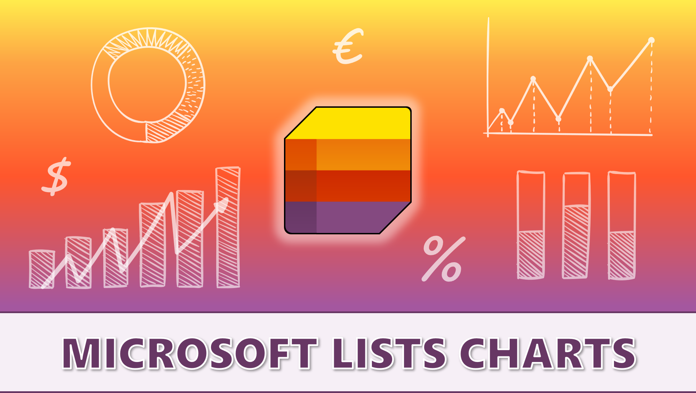

#### DISCLAIMER
Charts created with Microsoft Lists **DO NOT** replace other tools and apps for data analysis and visualization, such as [**Power BI**](https://powerbi.microsoft.com), QlikView, or Tableau. Instead, they should be seen as an additional support for publishing business information on **SharePoint pages**, thanks to the collection and sharing capabilities offered by Microsoft Lists.

| <h4>TABLE OF CONTENTS      </h4>|
|:-----------------|
|[**● SUMMARY**](#summary) [**● FEATURES OVERVIEW**](#how-does-it-work) [**● PERMISSIONS AND USER INTERFACE**](#permissions-and-user-interface) [**● LIST SETUP**](#list-setup) [**● GETTING STARTED**](#getting-started-with-your-chart) _________________ [**🞂 DOUGHNUT**](#doughnut) [**🞂 PIE**](#pie) [**🞂 BAR (VERTICAL)**](#bar-vertical) [**🞂 BAR (HORIZONTAL)**](#bar-horizontal) [**🞂 STACKED BARS**](#stacked-bars) [**🞂 LINE**](#line-chart) [**🞂 RADAR**](#radar-chart)|

## Summary
Thanks to JSON formatting, this templates package will allow you to quickly create **7 different types of charts**, which you can organize into collections, share, and publish on SharePoint pages. Microsoft 365 offers many options and ways to share and publish information in the form of charts. In particular, people involved in **internal communications** have now an extra tool available: **Microsoft Lists charts**.

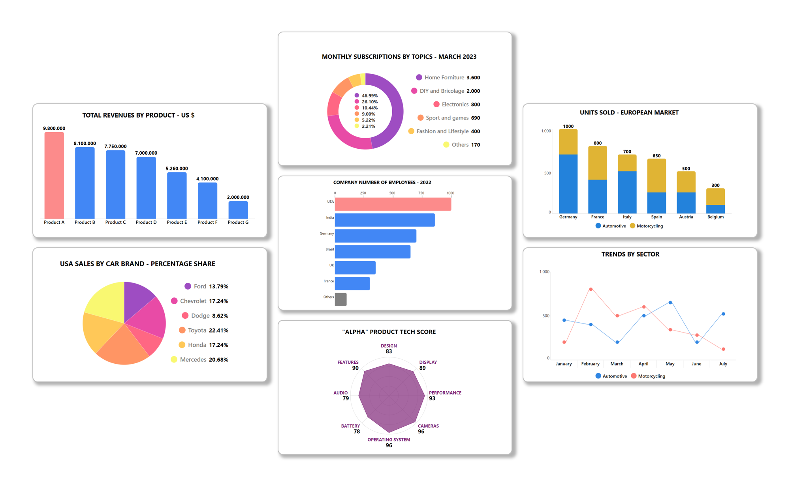

This solution has been tested with the following SharePoint pages layouts:

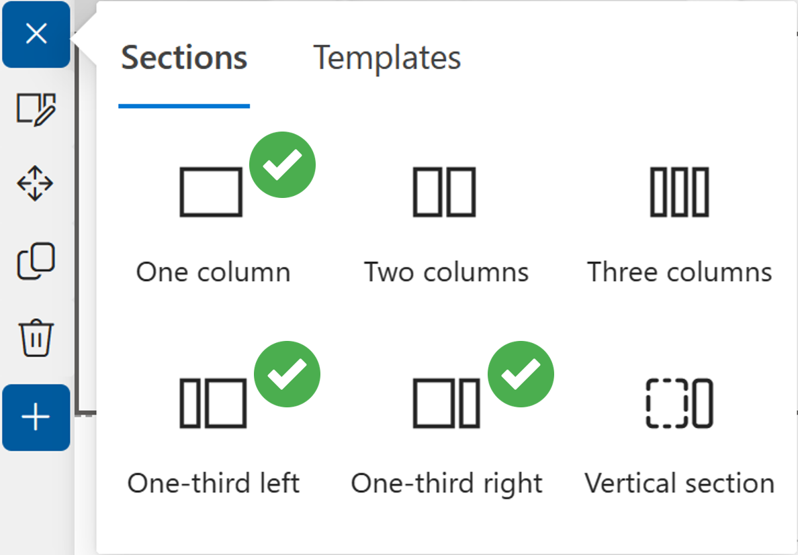

### HOW DOES IT WORK?
Each chart is contained in a [**custom list row**](https://learn.microsoft.com/sharepoint/dev/declarative-customization/view-list-formatting#build-custom-list-rows). It's possible to add or modify data using the [**built-in editing**](https://learn.microsoft.com/sharepoint/dev/declarative-customization/formatting-advanced#inline-editing) functionality in the same tile, without the need of opening the right pane, as well as renaming **labels** and modifying fill **colors** ([**HEX**](https://g.co/kgs/4Y9ABj) values or [**HTML**](https://www.w3schools.com/colors/colors_names.asp) names) of any graphic elements. All the charts samples take into account the following [**decimal separator**](https://en.wikipedia.org/wiki/Decimal_separator) standards: dot and comma.

Furthermore, to make some charts work properly, it's necessary to define a **scale**, based on the maximum data value expected.

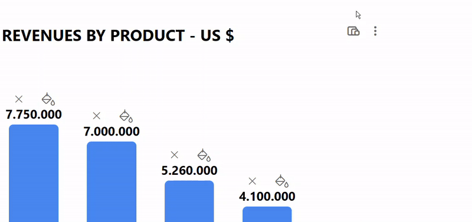

For example, if we wanted to display the number of products sold and the maximum value is 120000, then the scale could be equal to or greater than 120000. Alternatively, it could be 120, if we prefer to express all values in "_thousands of units_". In other words, a scale will provide a **scope** all values and their related visual elements will be displayed within. In the first sample image below the scale is 10000000 (ten millions) whereas in the second image it's 10. The visual result **is the same**, but we are expressing values according to different scales:

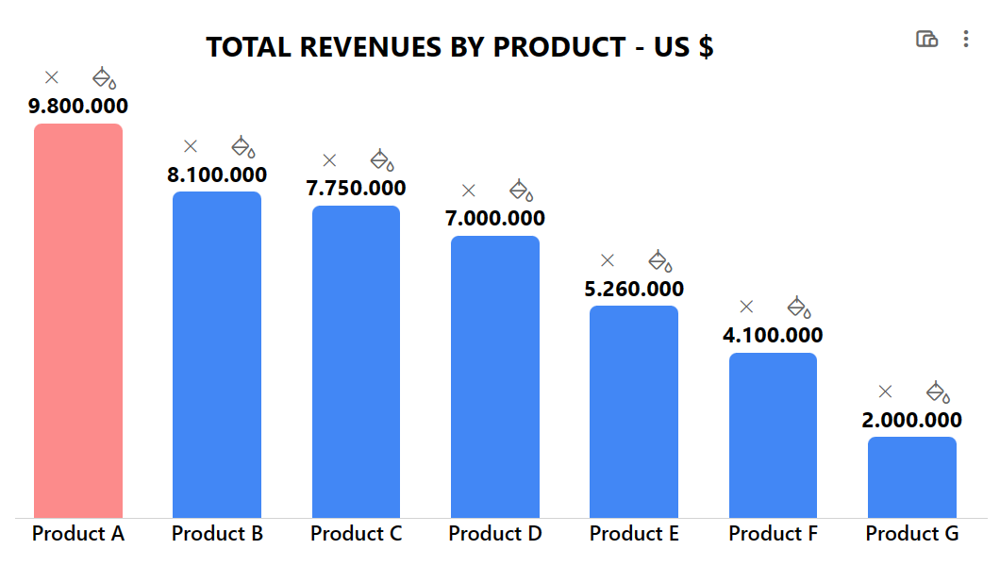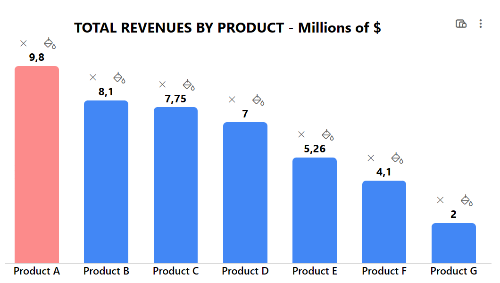

### PERMISSIONS AND USER INTERFACE
If you are planning to share or publish charts created with Microsoft Lists, you may want to make sure other people have only **read permission**, to prevent them from accidentally editing your data. But, at the same time, charts can be easily modified by taking advantage of the [**inline editing**](https://learn.microsoft.com/sharepoint/dev/declarative-customization/formatting-advanced#inline-editing) feature and that's why the conditional formatting of the JSON code templates comes into help, as shown in the user interface comparison below:

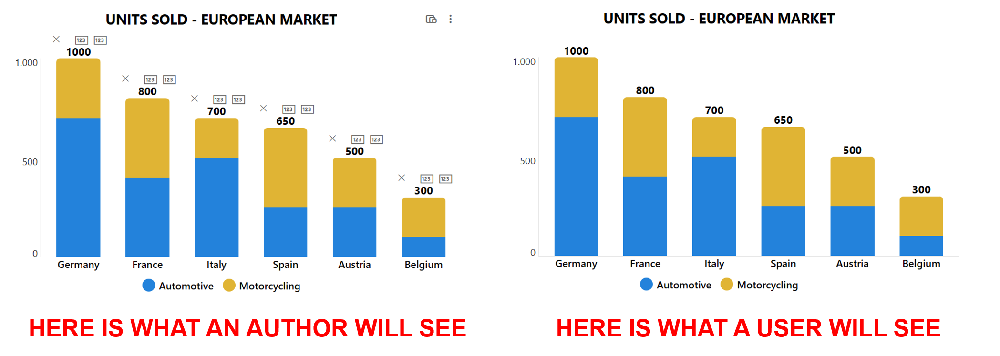

## View Requirements
The setup requires 4 steps:

**1.** For each template, download an Excel file containing a table and export it to SharePoint as illustrated [**here**](https://support.microsoft.com/office/export-an-excel-table-to-sharepoint-974544f9-94bc-4aa8-9159-97282d256dab). Here is a preview of the exporting feature location in Microsoft Excel desktop app:

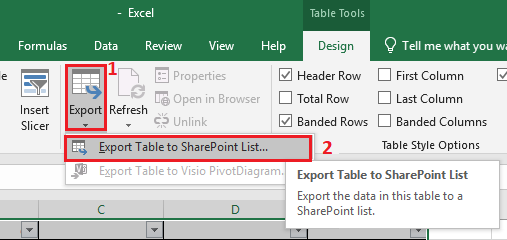

**2.** Numbers columns (named VALUE1, VALUE2, VALUE3_1, SCALE and so on) must have the following setup: no symbols, automatic number of decimal places, thousands separator enabled and informations required (no empty values allowed). On the other hand, single line of text columns (such as LABEL1, LABEL2, LABEL3, COLOR and so on) don't need any additional setup.

**3.** Create a new basic list view, **including the OOTB Author column**.

**4.** Copy the JSON code provided for each template, paste it into the view formatting box (Advanced formatting mode) and Save.

## GETTING STARTED WITH YOUR CHART
After applying the formatting with JSON code, you'll have to [**define a scale**](#how-does-it-work) and then add data labels. Click on the icon with three dots in the upper right corner to add new labels. Then, click on the interactive icons and boxes to modify the label names, insert numeric values, and apply a fill color of your choice to the graphic elements ([**HEX**](https://g.co/kgs/4Y9ABj) values or [**HTML**](https://www.w3schools.com/colors/colors_names.asp) names). Here is an example below with a scale set to 10:

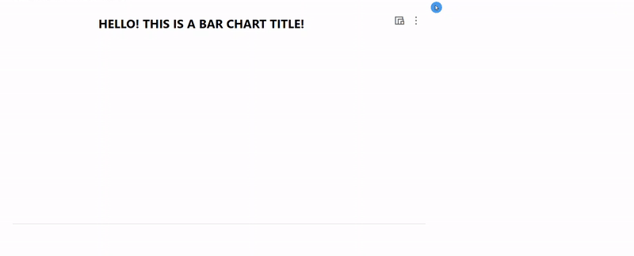

### DOUGHNUT
The Doughnut chart comes with two variations: one with percentages and values displayed and the other one without values. Both allow to display a maximum of 6 slices. You can apply a fill color to each arc. Download the [**Excel file**](./assets/Doughnut-Chart.xlsx) and export it to SharePoint. Then, apply the JSON code of the [**percentage+value**](./Doughnut-Chart-PV.json) version or the [**percentage only**](./Doughnut-Chart-P.json).

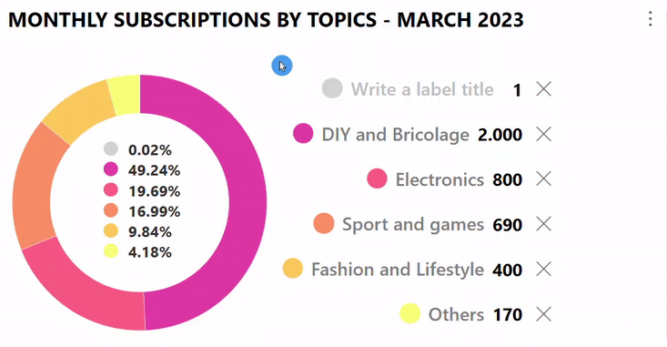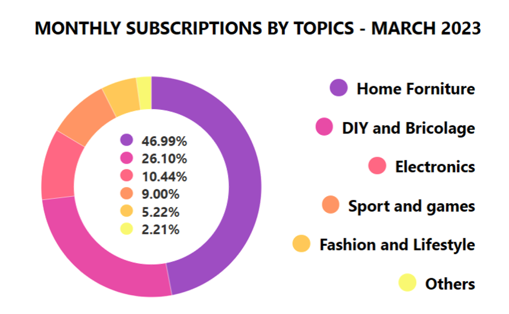

### PIE
The Pie chart allows to display a maximum of 6 slices. You can apply a fill color to each slice. Download the [**Excel file**](./assets/Pie-Chart.xlsx) and export it to SharePoint. Then, apply the JSON code of the [**standard version**](./Pie-Chart.json) or the [**larger one**](./Pie-Chart-Large.json).

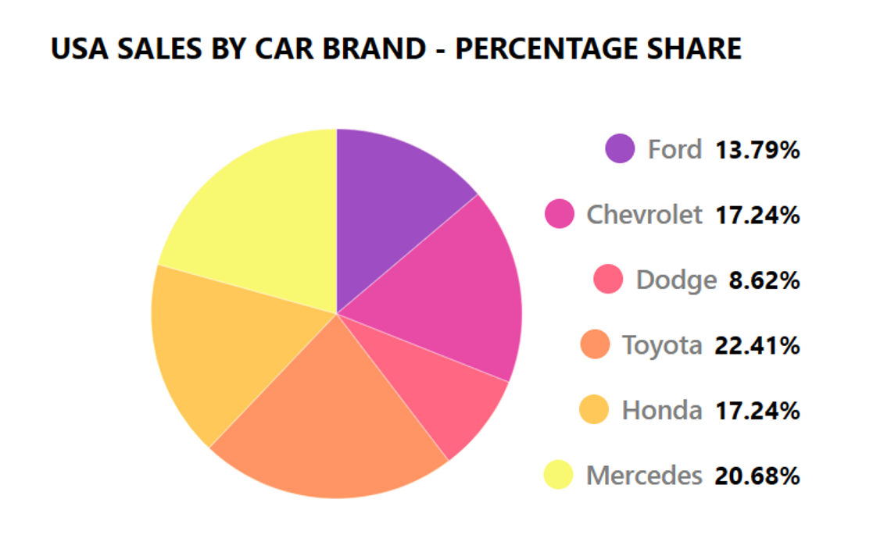

### BAR (Vertical)
The vertical bar chart allows a maximum of 10 bars. Each bar will adjust its width automatically, so that it will change based on how many bars are displayed overall. You can apply a fill color to each bar, also to highlight the maximum value as well as the minimum one. Download the [**Excel file**](./assets/Bar-Chart-V.xlsx) and to export it to SharePoint. Then, apply the JSON code of the [**7 bars version**](./Bar-Chart-V.json) or the larger one [**with 10 bars**](./Bar-Chart-V-Large.json).

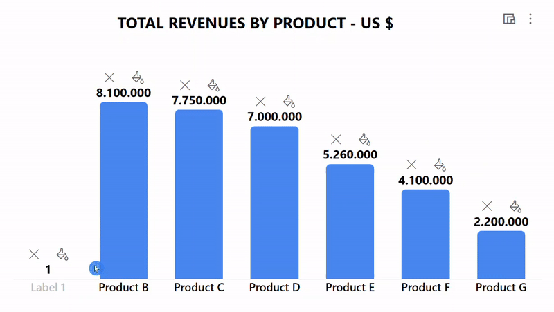

### BAR (Horizontal)
The horizontal bar chart allows a maximum of 7 bars. Each bar will adjust its height automatically, so that it will change based on how many bars are displayed overall. You can apply a fill color to each bar, also to highlight the maximum value as well as the minimum one. Download the [**Excel file**](./assets/Bar-Chart-H.xlsx) and export it to SharePoint. Then, apply the JSON code available [**here**](./Bar-Chart-H.json).

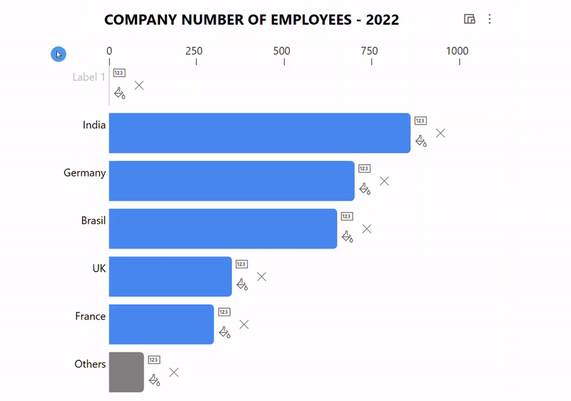

### STACKED BARS
The stacked bars chart allow a maximum of 10 bars and 2 categories. Each bar will adjust its width automatically, so that it will change based on how many bars are displayed overall. You can apply a fill color to each category. Download the [**Excel file**](./assets/Stacked-Bars-Chart.xlsx) and export it to SharePoint. Then, apply the JSON code of the [**6 bars version**](./Stacked-Bars-Chart.json) or the larger one [**with 10 bars**](./Stacked-Bars-Chart-Large.json).

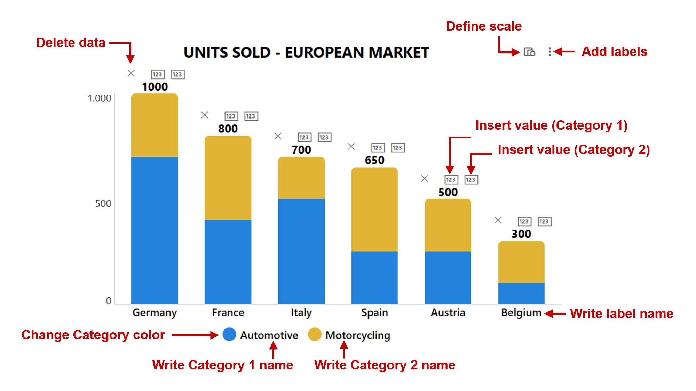

### LINE CHART
**Note**: number columns can be set to allow empty values.
The Line chart allows a maximum of 12 data points and 2 categories. You can apply a fill color to each category. Download the [**Excel file**](./assets/Line-Chart.xlsx) and export it to SharePoint. Then, apply the JSON code of the [**7 data-points version**](./Line-Chart.json) or the larger one [**with 12 data-points**](./Line-Chart-Large.json).

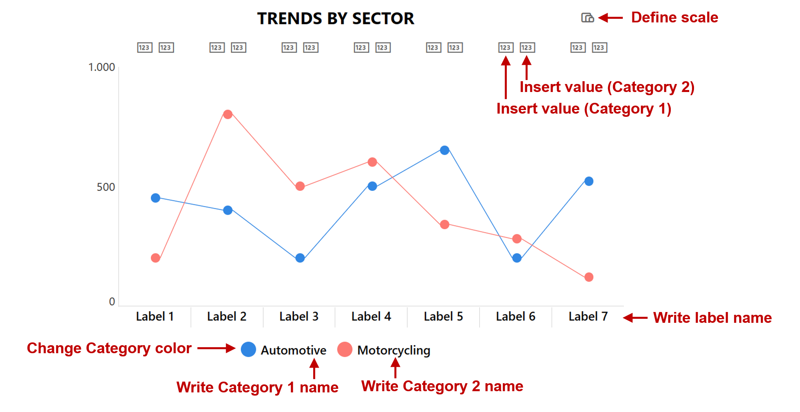

### RADAR CHART
**Note**: this chart is based on a maximum score, which works similarly to a scale, as explained [**above**](#how-does-it-work). Furthermore, **DATAPOINTS** is a number column and should allow values between 3 and 8.

The radar chart allows a minimum of 3 (triangle shape) and a maximum of 8 (octagon shape) data points. You can apply a fill color to both labels and shape.
Download the [**Excel file**](./assets/Radar-Chart.xlsx) and export it to SharePoint. Then, apply the JSON code available [**here**](./Radar-Chart.json).

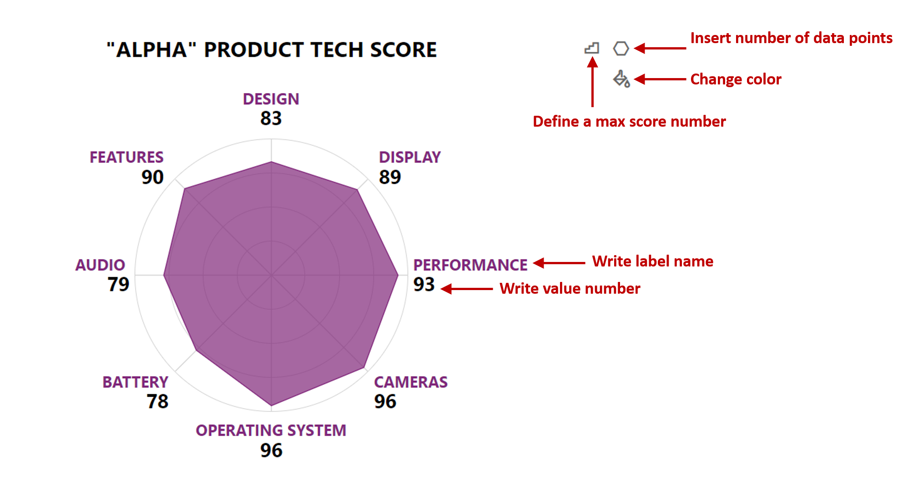

## Sample

Solution|Author(s)
--------|---------
Bar-Chart-H.json | [Federico Sapia](https://github.com/Fedes365)
Bar-Chart-V-Large.json | [Federico Sapia](https://github.com/Fedes365)
Bar-Chart-V.json | [Federico Sapia](https://github.com/Fedes365)
Doughnut-Chart-P.json | [Federico Sapia](https://github.com/Fedes365)
Doughnut-Chart-PV.json | [Federico Sapia](https://github.com/Fedes365)
Line-Chart-Large.json | [Federico Sapia](https://github.com/Fedes365)
Line-Chart.json | [Federico Sapia](https://github.com/Fedes365)
Pie-Chart-Large.json | [Federico Sapia](https://github.com/Fedes365)
Pie-Chart.json | [Federico Sapia](https://github.com/Fedes365)
Stacked-Bars-Chart-Large.json | [Federico Sapia](https://github.com/Fedes365)
Stacked-Bars-Chart.json | [Federico Sapia](https://github.com/Fedes365)
Radar-Chart.json | [Federico Sapia](https://github.com/Fedes365)

## Version history

Version |Date              |Comments
--------|------------------|--------------------------------
1.0     |March 22, 2023  |Initial release
2.0     |November 21, 2023  |Added Radar-Chart

## Disclaimer
**THIS CODE IS PROVIDED *AS IS* WITHOUT WARRANTY OF ANY KIND, EITHER EXPRESS OR IMPLIED, INCLUDING ANY IMPLIED WARRANTIES OF FITNESS FOR A PARTICULAR PURPOSE, MERCHANTABILITY, OR NON-INFRINGEMENT.**

