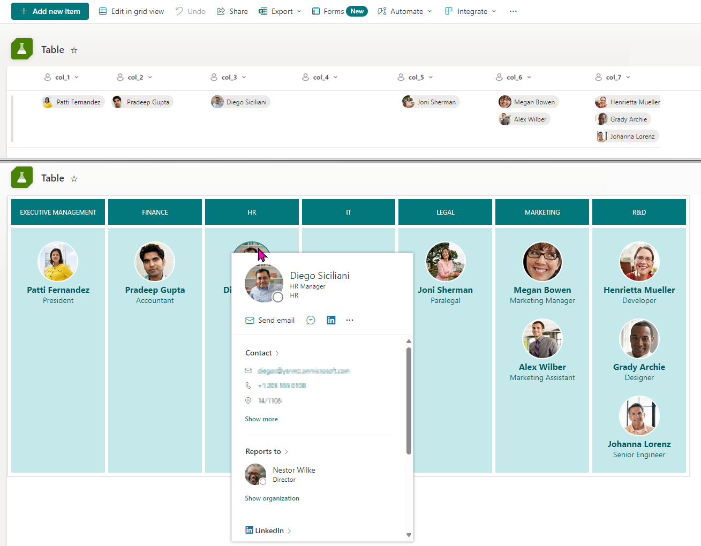
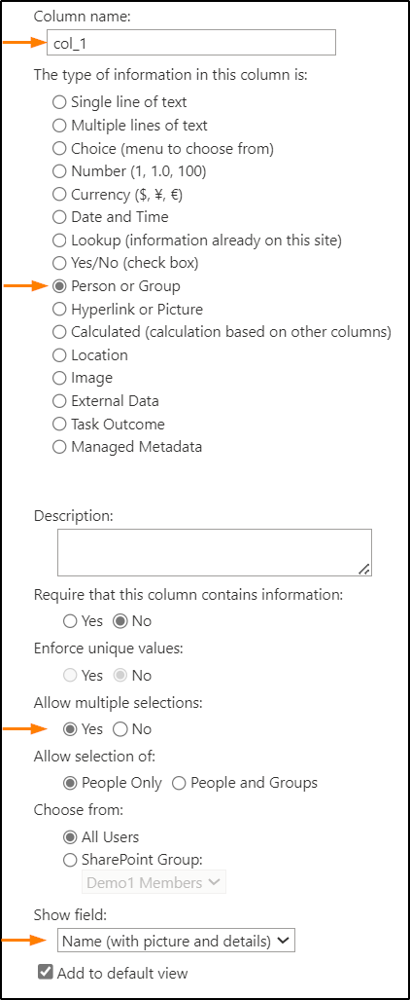

# Department Members List

## Summary

This sample demonstrates how to turn list items into a custom table and bring additional information from the Person column.

## View requirements
Required|Type|Internal Name
--------|----|-
No | Person or Group | col_1
No | Person or Group | col_2
No | Person or Group | col_3
No | Person or Group | col_4
No | Person or Group | col_5
No | Person or Group | col_6
No | Person or Group | col_7

> [!NOTE]  
> - It is necessary to set the `Show field` value to `Name (with picture and details)` to display the jobTitle field from the Person column. (Related issue: [SharePoint/sp-dev-docs#10063](https://github.com/SharePoint/sp-dev-docs/issues/10063))  
> - Set `Allow multiple sections` to `Yes`.  
>    

## Sample

Solution|Author(s)
--------|-
department-members-list.json | [Watana](https://github.com/watana2)

## Version history
Version|Date|Comments
-------|----|-
1.0    | December 22, 2024 | Initial release

## Disclaimer
**THIS CODE IS PROVIDED *AS IS* WITHOUT WARRANTY OF ANY KIND, EITHER EXPRESS OR IMPLIED, INCLUDING ANY IMPLIED WARRANTIES OF FITNESS FOR A PARTICULAR PURPOSE, MERCHANTABILITY, OR NON-INFRINGEMENT.**

