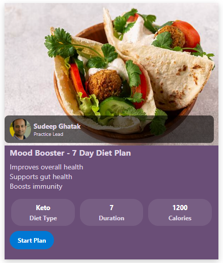
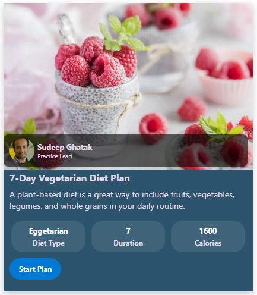

# Diet Plan Card Formatter

## Summary

This SharePoint JSON view formatting sample transforms your list items into rich, visually appealing diet plan cards. Each card highlights a meal or plan with a banner image, author details, key nutritional values, and a prominent call-to-action button.
This layout is ideal for health & wellness portals, employee fitness programs, or meal planning lists.

## View requirements

### 📝 Recommended SharePoint List Columns

| Column Name           | Type                   | Description                               |
| --------------------- | ---------------------- | ----------------------------------------- |
| Title                 | Single line of text    | Name of the meal or plan                  |
| BannerImageUrl        | Single line of text    | URL to the header image                   |
| Author                | Person or Group        | Creator of the plan                       |
| Benefits              | Multiple lines of text | Key benefits of the plan                  |
| DietType              | Choice                 | Type of diet (e.g., Keto, Vegan)          |
| Duration              | Number                 | Duration in days or weeks                 |
| Calories              | Number                 | Caloric value                             |
| PlanLink              | Hyperlink or Picture   | Link to full plan details                 |
| BackgroundColor       | Single line of text    | Background color for the card             |
| ButtonBackgroundColor | Single line of text    | Background color for the metric buttons   |
| ForegroundColor       | Single line of text    | Text/icon color inside the metric buttons |

A PowerShell Script (Create List.ps1) has been provided in the assets folder to provision the list for you.

**Note:** This script uses [PnP PowerShell](https://pnp.github.io/powershell/) and requires an environment ready for PnP PowerShell.

## Sample

Solution|Author
--------|---------
diet-plan-card.json | [Sudeep Ghatak](https://github.com/sudeepghatak) ([LinkedIn](https://www.linkedin.com/in/sudeepghatak/))

## Version history

Version|Date|Comments
-------|----|--------
1.0|May 03, 2025|Initial release

## Disclaimer
**THIS CODE IS PROVIDED *AS IS* WITHOUT WARRANTY OF ANY KIND, EITHER EXPRESS OR IMPLIED, INCLUDING ANY IMPLIED WARRANTIES OF FITNESS FOR A PARTICULAR PURPOSE, MERCHANTABILITY, OR NON-INFRINGEMENT.**

---

## Additional notes

- This sample also includes command bar customization, and the "Add new item" button will be hidden.

