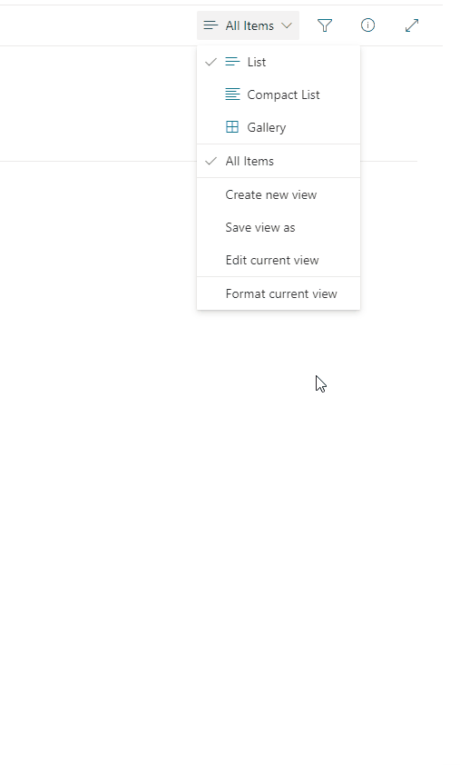

# Disable default click action on a tile list view

## Summary
The sample list of items in a tile view where default click action is disabled. When item is clicked it is selected only.

> [!NOTE]  
> - The list shown above is not part of this sample. It's just a sample list where this format was applied.
> - When you single-click, the item is selected, but when you double-click, the list form opens.

## View requirements

None

## Sample

Solution|Author(s)
--------|---------
disable-click-action.json | [Michal Ziemba](https://github.com/Michal-Ziemba)

## Version history

Version|Date|Comments
-------|----|--------
1.0|April 8, 2022|Initial release
1.1|February 27, 2024|Fixed so that the list form does not appear after a click.

## Disclaimer
**THIS CODE IS PROVIDED *AS IS* WITHOUT WARRANTY OF ANY KIND, EITHER EXPRESS OR IMPLIED, INCLUDING ANY IMPLIED WARRANTIES OF FITNESS FOR A PARTICULAR PURPOSE, MERCHANTABILITY, OR NON-INFRINGEMENT.**

---

## Additional notes
Any potential additional notes to get included in the readme around the sample with additional pictures etc.

- Adjust the  "height", "width" paramters to your individual needs or remove them to get a standard size of a tile.

