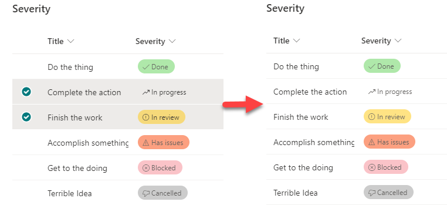

# Disable Selection

## Summary
This is a very basic sample that disables list item selection within your view.

> The formatted choice column shown above is not part of this sample, it's just part of the list where this sample was applied

## View requirements

None

## Sample

Solution|Author(s)
--------|---------
disable-selection.json | [Chris Kent](https://github.com/thechriskent)

## Version history

Version|Date|Comments
-------|----|--------
1.0|June 4, 2021|Initial release

## Disclaimer
**THIS CODE IS PROVIDED *AS IS* WITHOUT WARRANTY OF ANY KIND, EITHER EXPRESS OR IMPLIED, INCLUDING ANY IMPLIED WARRANTIES OF FITNESS FOR A PARTICULAR PURPOSE, MERCHANTABILITY, OR NON-INFRINGEMENT.**

