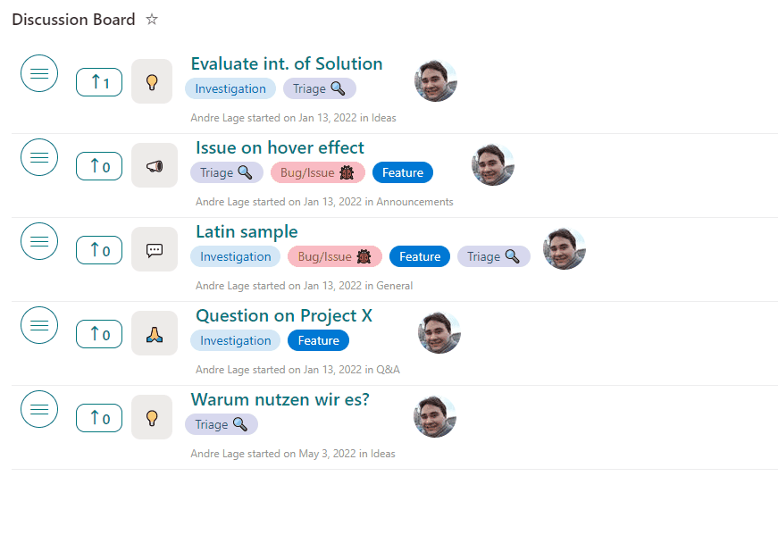

# Discussion Board

## Summary

This sample transforms your list into a discussion board with title, desription, tags, and votes are available. Additionally, users can react, comment, and perform inline edits!

## View requirements
- The format expect the following fields:

Field |Type
--------|---------
Title | Single line of text 
Description | Multiple lines of text
Categories | Choice - Possible options "📣 Announcements, 💬 General, 💡 Ideas, 🙏 Q&A, 🙌 Show"
Tags | Choice - include following options "Triage 🔍,Investigation, Feature, Bug/Issue 🐞"
Vote | Person  - Allow multiple selections 
Emotion | Multiple lines of text - Store icons for users
EmotionCount | Single line of text  - stores counts of icons
Expand | Yes/No

Edit View requirements
- Include in View the following additional fields `Created`, `Created By`, `Modified` and `Modified By`.

## Sample

Solution|Author(s)
--------|---------
discussion-board.json | [André Lage](https://github.com/aaclage) ([@aaclage](https://twitter.com/aaclage))
discussion-board-format.json | [André Lage](https://twitter.com/aaclage)
discussion-board-timeline-format.json | [André Lage](https://twitter.com/aaclage)

## Version history

Version|Date|Comments
-------|----|--------
2.0|May 11, 2022| updated with new features
1.0|January 30, 2022|Initial release

## Disclaimer

**THIS CODE IS PROVIDED *AS IS* WITHOUT WARRANTY OF ANY KIND, EITHER EXPRESS OR IMPLIED, INCLUDING ANY IMPLIED WARRANTIES OF FITNESS FOR A PARTICULAR PURPOSE, MERCHANTABILITY, OR NON-INFRINGEMENT.**

---

## Additional notes
None

