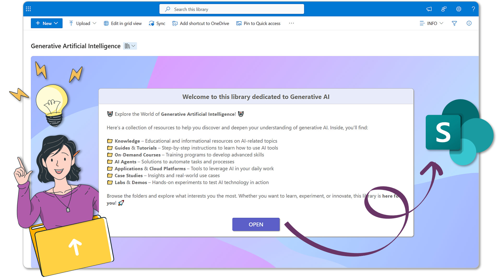
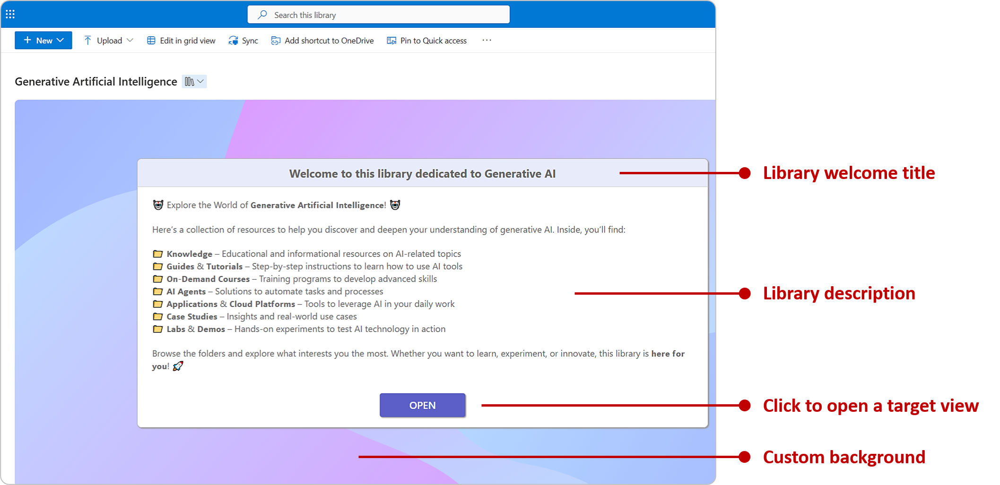
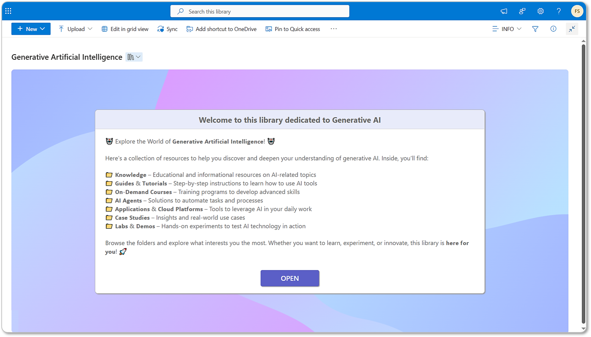

# Document Library Information Pane

## Summary
This tutorial will help you create a document library information pane through JSON view formatting. Thanks to JSON formatting, it's possible to create a large custom card to be used as an information pane or landing page, by taking advantage of the [row formatting](https://learn.microsoft.com/sharepoint/dev/declarative-customization/view-list-formatting#build-custom-list-rows) feature.

## Why a Library information pane?
Whenever we share a document library, an information pane or landing page can be useful to welcome users and engage them, providing information about its content and making it easier to use.

## Hardcoded JSON: columns are not required!
Yes, you got it right. This sample JSON is "hardcoded" and no columns are required to make it work. You can customize it by replacing the sample text with your own (read "how to" section below).

## Solution breakdown

Here is a visual description of the user interface:

## How to

**1) New library view:** create a new document library "List" type view. You can setup it as a default view or not

**2) Test document upload:** if your document library is empty, upload a sample document for testing purpose, since the landing page is displayed thanks to the first row index taken by a file stored in a SharePoint library

**3) JSON code:** copy the JSON code available [here](./DL-Information-Pane.json) and paste it into the view formatting box (Advanced formatting mode)

Here is a preview of what you'll get:

## Sample customization

As previously mentioned above, you can replace the sample text with your own. Open the JSON advanced formatting box and replace with your text into the following lines of code:

**💠 Library welcome title** - Line n. 86

**💠 Background** - Line n. 41 - Paste your image direct URL. Most common image file formats supported, such as jpg, png, svg etc. If your image is stored in SharePoint, please make sure your users have **read permission** for the source image file.

**💠 Library description** - Line n. 108 - To avoid complexity, instead of using multiple text boxes, the description section makes use of a JSON [specification](https://www.json.org/json-en.html). Thanks to **\n** it's possible to render as many lines of text as we want (see JSON specs below):

**💠 Library OPEN button link** - Line n. 153 - Replace the sample link with a target view of your document library. For example the *out-of-the-box* "All Documents" one.

## ⚠️ Important notes

If nothing is rendered, it's likely that you have customized an **empty** document library. No panic, just upload a testing file (any Word, PowerPoint, Excel etc. file you want) in order to have full visual control of you JSON customization. After uploading other real documents, you can delete this sample file.

## Sample

Solution|Author(s)
--------|---------
DL-Information-Pane.json | [Federico Sapia](https://github.com/Fedes365) ([LinkedIn](https://www.linkedin.com/in/federicosapia/))

## Version history

Version |Date              |Comments
--------|------------------|--------------------------------
1.0     |April 12, 2025  |Initial release

## Disclaimer
**THIS CODE IS PROVIDED *AS IS* WITHOUT WARRANTY OF ANY KIND, EITHER EXPRESS OR IMPLIED, INCLUDING ANY IMPLIED WARRANTIES OF FITNESS FOR A PARTICULAR PURPOSE, MERCHANTABILITY, OR NON-INFRINGEMENT.**

