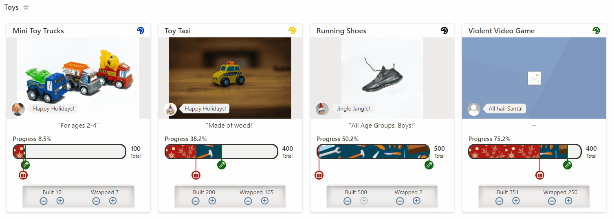

# Elf Progress Board

## Summary
This sample demonstrates:
- Handling Image fields, including providing default display for missing values
- Randomization (random elf quote)
- Multi-level progress bar using images
- inlineEditField
- setValue

## View requirements

|Type|Internal Name|Required|
|---|---|:---:|
|Single line of text|Title|Yes|
|Person|ElfInCharge|Yes|
|Multi-line Text|Description||
|Number|Quantity||
|Number|Built||
|Number|Wrapped||
|Managed Metadata|ToyColor||
|Image|ToyImage||

## Sample

Solution|Author(s)
--------|---------
elf-progress-board.json | [Chris Kent](https://github.com/thechriskent) ([@thechriskent](https://twitter.com/thechriskent))

## Version history

Version|Date|Comments
-------|----|--------
1.0|December 9, 2021|Initial release

## Disclaimer
**THIS CODE IS PROVIDED *AS IS* WITHOUT WARRANTY OF ANY KIND, EITHER EXPRESS OR IMPLIED, INCLUDING ANY IMPLIED WARRANTIES OF FITNESS FOR A PARTICULAR PURPOSE, MERCHANTABILITY, OR NON-INFRINGEMENT.**

---

