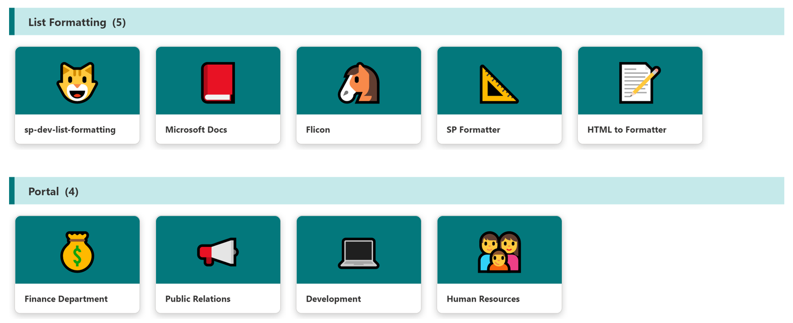

# Link collection using Emoji

## Summary
This sample demonstrates a link collection using Emoji and is a customization of the `Gallery` layout. Additionally, this sample combines group customization with a tile format.

## View requirements

|Type               |Internal Name|Required|
|-------------------|-------------|:------:|
|Single line of text|Title        |Yes     |
|Single line of text|Category     |Yes     |
|Single line of text|URL          |Yes     |
|Single line of text|Emoji        |Yes     |

Set up grouping in `Category` column

## Sample

Solution                    |Author(s)
----------------------------|---------------------------
emoji-link-tile-format.json |[Tetsuya Kawahara](https://twitter.com/techan_k)

## Version history

Version |Date          |Comments
--------|--------------|--------------------------------
1.0     |April 5, 2021 |Initial release

## Disclaimer
**THIS CODE IS PROVIDED *AS IS* WITHOUT WARRANTY OF ANY KIND, EITHER EXPRESS OR IMPLIED, INCLUDING ANY IMPLIED WARRANTIES OF FITNESS FOR A PARTICULAR PURPOSE, MERCHANTABILITY, OR NON-INFRINGEMENT.**

