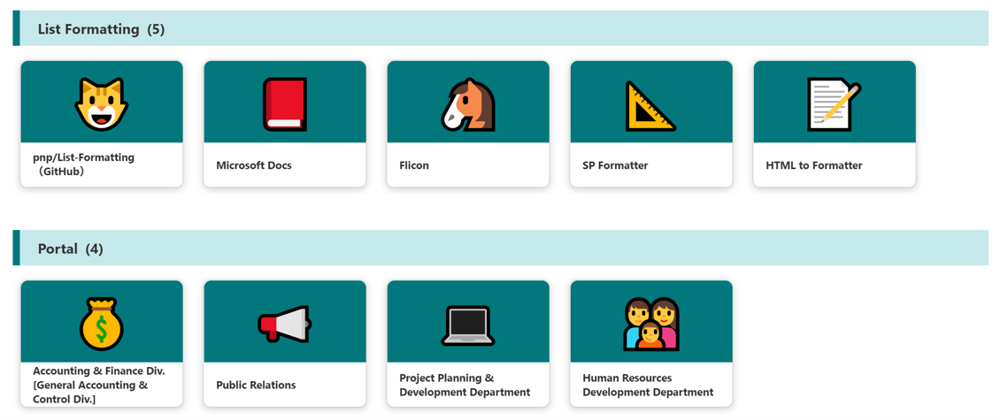

# Link Collection using Emojis

## Summary
This sample demonstrates a link collection using Emoji and is a customization of the `Gallery` layout. Additionally, this sample combines group customization with a tile format.

## View requirements

|Type               |Internal Name|Required|
|-------------------|-------------|:------:|
|Single line of text|Title        |Yes     |
|Single line of text|Category     |Yes     |
|Single line of text|URL          |Yes     |
|Single line of text|Emoji        |Yes     |
|Image              |Image        |No      |

Set up grouping in `Category` column

## Sample

Solution|Author(s)
--------|---------
emoji-link-tiles.json | [Tetsuya Kawahara](https://github.com/tecchan1107) ([@techan_k](https://twitter.com/techan_k))
image-link-tiles.json | [Watana](https://github.com/watana2)

## Version history

Version |Date          |Comments
--------|--------------|--------------------------------
1.0     |April 5, 2021 |Initial release
1.1     |November 18, 2024 |added image link tiles sample

## Disclaimer
**THIS CODE IS PROVIDED *AS IS* WITHOUT WARRANTY OF ANY KIND, EITHER EXPRESS OR IMPLIED, INCLUDING ANY IMPLIED WARRANTIES OF FITNESS FOR A PARTICULAR PURPOSE, MERCHANTABILITY, OR NON-INFRINGEMENT.**

