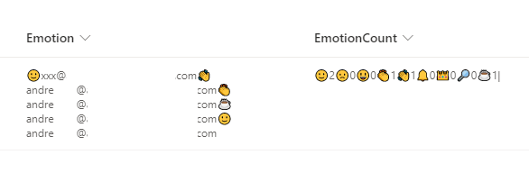

# Emoji Reactions

## Summary

This sample demonstrates reacting with an emoji. Who reacted and the total counts per reaction are stored with the list item.

Two versions are provided. The first, emoji-reactions.json, displays the reactions of the current user and allows them to react. The section, emoji-reactions-count.json, displays reactions from all users and the count of each reaction type.

### emoji-reactions-count.json

  - Below provides how the counting board is organized by users.

## View requirements
- The format expect the following fields:

Field |Type
--------|---------
Title | Single line of text 
Emotion | Multiple line of text - Stores reactions for users
EmotionCount | Single line of text  - Stores count of reactions

Here's how the storage looks behind the scenes:

## Sample

Solution|Author(s)
--------|---------
emoji-reactions.json | [André Lage](https://github.com/aaclage) ([@aaclage](https://twitter.com/aaclage))
emoji-reactions-count.json | [André Lage](https://github.com/aaclage) ([@aaclage](https://twitter.com/aaclage))

## Version history

Version|Date|Comments
-------|----|--------
1.0|January 12, 2022|Initial release

## Disclaimer

**THIS CODE IS PROVIDED *AS IS* WITHOUT WARRANTY OF ANY KIND, EITHER EXPRESS OR IMPLIED, INCLUDING ANY IMPLIED WARRANTIES OF FITNESS FOR A PARTICULAR PURPOSE, MERCHANTABILITY, OR NON-INFRINGEMENT.**

---

## Additional notes
None

