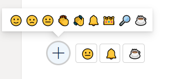

# emotions emoji format

## Summary

This sample allow the selection of emotions emojis based on html unicode in 2 formats **Emotions-single-format** and **Emotions-format**.

- **Emotions-single-format**:
  - This format display emotion emojis of current user. This format required the field **"Emotion"**.

- **Emotions-format**:
  - This format display emotion emojis selected by users and their counting, this format stores counting of emotions in separate column to display in the format. This format required the fields **"Emotion"** and **"EmotionCount"**.

  - Below provides how the counting board is organized by users.

## View requirements
- The format expect the following fields:

Field |Type
--------|---------
Title | Single line of text 
Emotion | Multiple line of text - Store icons for users
EmotionCount | Single line of text  - stores counts of icons

## Sample

Solution|Author(s)
--------|---------
emotions-single-format.json | [André Lage](https://twitter.com/aaclage)
emotions-format.json | [André Lage](https://twitter.com/aaclage)

## Version history

Version|Date|Comments
-------|----|--------
1.0|January 12, 2022|Initial release

## Disclaimer

**THIS CODE IS PROVIDED *AS IS* WITHOUT WARRANTY OF ANY KIND, EITHER EXPRESS OR IMPLIED, INCLUDING ANY IMPLIED WARRANTIES OF FITNESS FOR A PARTICULAR PURPOSE, MERCHANTABILITY, OR NON-INFRINGEMENT.**

---

## Additional notes
None

