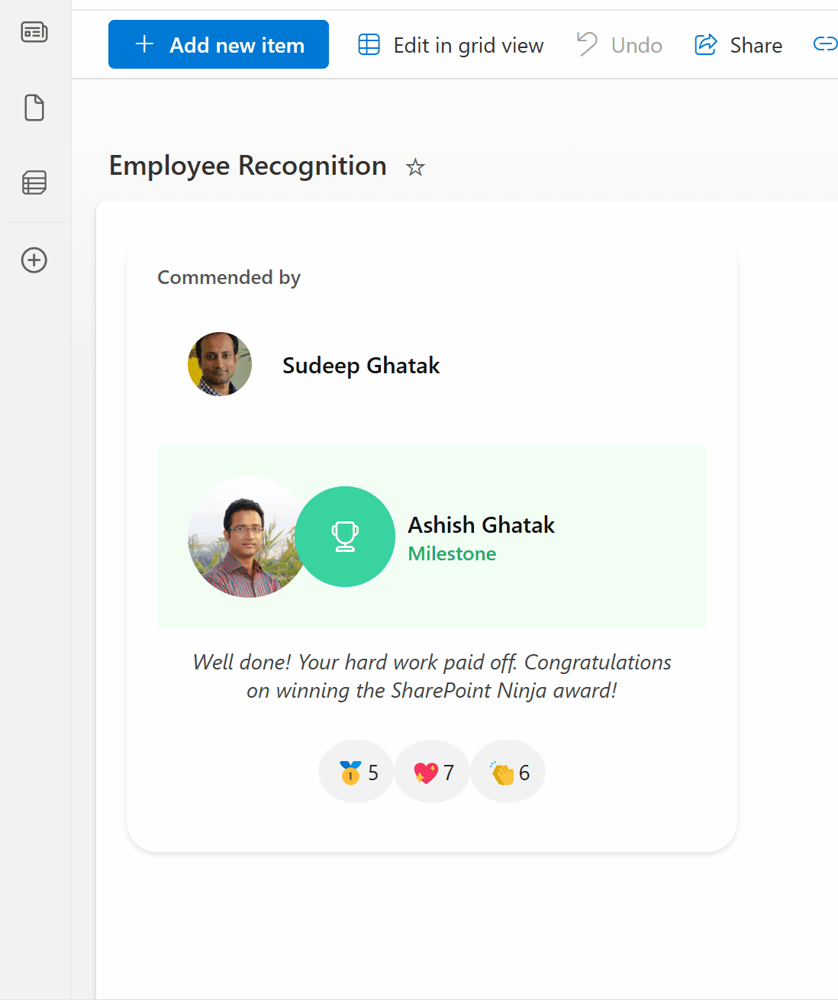

# Employee recognition Card

## Summary

This sample acts as a digital shout-out board for your team, built right into SharePoint. It gives employees an easy way to recognize and appreciate each other's hard work. Colleagues can show their support by clicking on emojis to cast their votes.

## View requirements

### 📝 Recommended SharePoint List Columns

| Column Name         | Type                 |
|---------------------|----------------------|
| Title               | Single line of text  |
| From                | Person or Group      |
| To                  | Person or Group      |
| Message             | Multiple lines of text |
| AwardType           | Choice               |
| Reactions_Medal     | Number               |
| Reactions_Heart     | Number               |
| Reactions_Clap      | Number               |
| DateRecognized      | Date and Time        |

A PowerShell Script (Create List.ps1) has been provided in the assets folder to provision the list for you.

## Sample

Solution|Author
--------|---------
employee-recognition.json | [Sudeep Ghatak](https://github.com/sudeepghatak) ([LinkedIn](https://www.linkedin.com/in/sudeepghatak/))

## Version history

Version|Date|Comments
-------|----|--------
1.0|Apr 21, 2024|Initial release

## Disclaimer
**THIS CODE IS PROVIDED *AS IS* WITHOUT WARRANTY OF ANY KIND, EITHER EXPRESS OR IMPLIED, INCLUDING ANY IMPLIED WARRANTIES OF FITNESS FOR A PARTICULAR PURPOSE, MERCHANTABILITY, OR NON-INFRINGEMENT.**

---

## Additional notes

None

