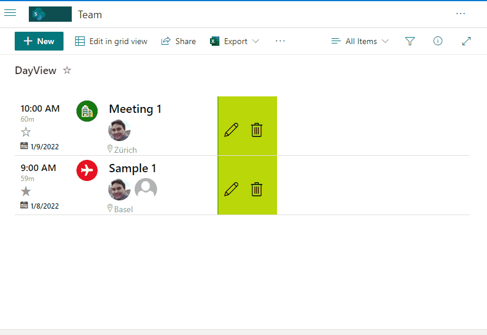

# Event Registration

## Summary

This sample provides Event registration with different capabilities such us Start and End dates, Category, Attendees, All Day option, Location, Team URL, and favoriting.

## View requirements
This sample is not intended to be used with the standard Events list but rather a custom list with the following fields:

Field |Type
--------|---------
Title | Single line of text 
Description | Multiple lines of text
StartDate | Date and Time
EndDate | Date and Time
Category | Choice - include option "Meeting, Work hours, Business, Holiday, Get-together, Gifts, Birthday"
Categorize | Choice - "Red, Blue, Green, Orange, Purple, Yellow"
Attendees | Person - Allow multiple selections
AllDay | Yes/No - Default **"No"**
Location | Single line of text 
TeamUrl | Single line of text 
Favorite | Yes/No - Default **"No"**
Difference | Calculated - include formula "=INT((EndDate-StartDate)*1440)" to retrieve minutes from event

Edit View requirements
- Include `Modified by` and `Modified` columns in View
- Sort View by `StartDate` descending.

## Sample

Solution|Author(s)
--------|---------
event-registration.json | [André Lage](https://github.com/aaclage)

## Version history

Version|Date|Comments
-------|----|--------
1.0|January 12, 2022|Initial release

## Disclaimer

**THIS CODE IS PROVIDED *AS IS* WITHOUT WARRANTY OF ANY KIND, EITHER EXPRESS OR IMPLIED, INCLUDING ANY IMPLIED WARRANTIES OF FITNESS FOR A PARTICULAR PURPOSE, MERCHANTABILITY, OR NON-INFRINGEMENT.**

---

## Additional notes
None

