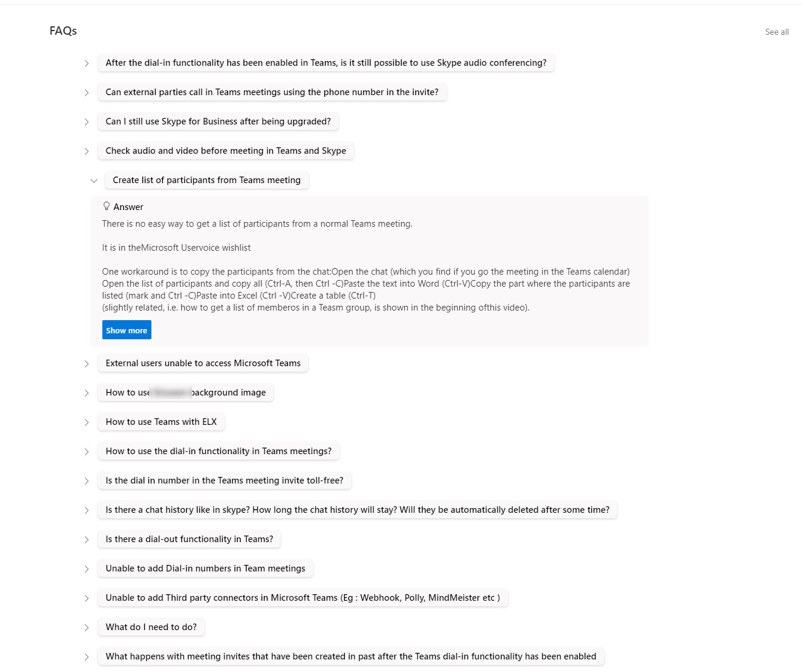

# FAQ Accordion

## Summary
This sample formats your view to appear and work like an Accordion style FAQ (Frequently Asked Questions). This view is responsive.

## View requirements

Column Name   |Type
--------------|--------------
Title         | Single Line Text
Question      | Single Line Text
Answer     | *Multi Line Text
ShowMore     | Single Line Text

Apply a Group By on the Question column in your view.
*Only Multiple lines of text type Plan text works with the solution (select from list settings for the multiple line of text: Plain Text)
## Sample

Solution|Author(s)
--------|---------
faq-accordion.json | [Anand Vadivelan](https://github.com/anandragav) ([@anandVragav](https://twitter.com/anandVragav))

## Version history

Version |Date              |Comments
--------|------------------|--------------------------------
1.0     |July 9, 2021  |Initial release

## Disclaimer
**THIS CODE IS PROVIDED *AS IS* WITHOUT WARRANTY OF ANY KIND, EITHER EXPRESS OR IMPLIED, INCLUDING ANY IMPLIED WARRANTIES OF FITNESS FOR A PARTICULAR PURPOSE, MERCHANTABILITY, OR NON-INFRINGEMENT.**

