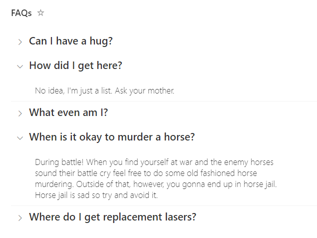

# Grouped FAQs

## Summary
This sample uses standard group rendering to provide a list of expandable questions. By default, when grouping by a column the column name and the count of grouped items will be included in the group name. This format provides some small tweaks to the group header to only show the value (question in this case). By also hiding the column header and item selection, this format acts like a mini application and could easily be added to a page using the list web part.

This sample includes two variations: the original `faq-grouped.json` and `faq-grouped-full-width-answer.json`.
- **faq-grouped.json** – Applies formatting only to the group header. The width of the answer depends on the column width.
- **faq-grouped-full-width-answer.json** – Also includes a `rowFormatter` to style the entire row, allowing the answer to span the full width of the page. However, only the `Answer` column is shown; other columns are not displayed.

## View requirements

|Type|Internal Name|Required|
|---|---|:---:|
|Single line of text|Title|Yes|
|Multiple line of text|Answer|Yes|

In this case, the Title column has been renamed to Question (though it doesn't make any difference to the format). The view is grouped by the Question (Title) column and then the Question column has been removed from display (so that the value doesn't repeat alongside the answer).

> FAQs - Stands for **F**requently **A**sked **Q**uestions

## Sample

Solution|Author(s)
--------|---------
faq-grouped.json | [Chris Kent](https://github.com/thechriskent) ([@thechriskent](https://twitter.com/thechriskent))
faq-grouped-full-width-answer.json | [Steve Corey](https://github.com/stevecorey365)

## Version history

Version|Date|Comments
-------|----|--------
1.0|April 15, 2022|Initial release
1.1|August 11, 2025|Added `faq-grouped-full-width-answer.json`

## Disclaimer
**THIS CODE IS PROVIDED *AS IS* WITHOUT WARRANTY OF ANY KIND, EITHER EXPRESS OR IMPLIED, INCLUDING ANY IMPLIED WARRANTIES OF FITNESS FOR A PARTICULAR PURPOSE, MERCHANTABILITY, OR NON-INFRINGEMENT.**

---

