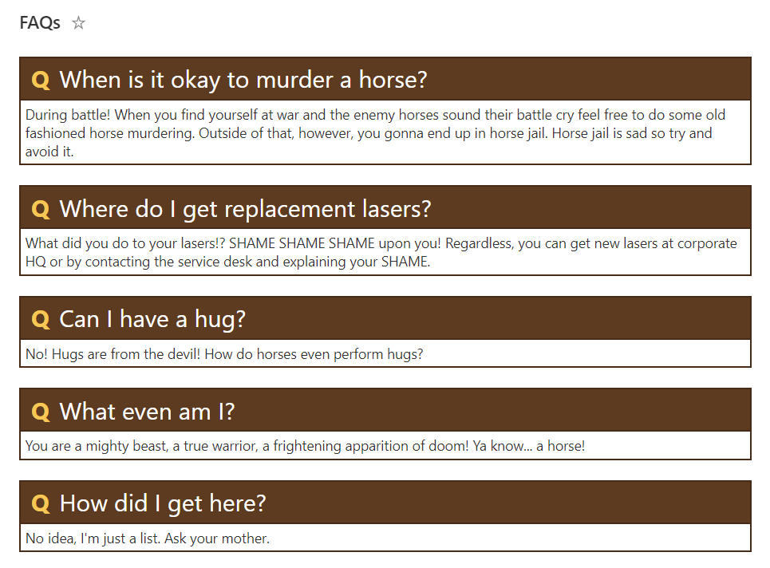
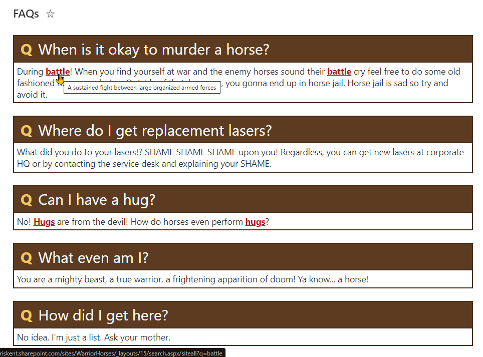

# FAQs

## Summary
This sample creates a theme-aware format to use when displaying FAQs (Frequently Asked Questions).

### faqs-with-keywords.json

An advanced version of the sample is also included that allows specific keywords within the answer to be turned into links.

The Keyword field is used to match a value in the Answer column, and adds a hyperlink from the KeywordLink field to that value in the Answer column. In the below example, the formatting will change the "information" column in the Answer field, to a hyperlink linking to https://www.microsoft.com

* Title - "What's the difference between 32-bit and 64-bit versions of windows?"
* Answer - "The terms 32-bit and 64-bit refer to the way a computer's processor (also called a CPU) handles information. The 64-bit version of Windows handles large amounts of random access memory (RAM) more effectively than a 32-bit system. Not all devices can run the 64-bit versions of Windows."
* Keyword - "Information"
* KeywordLink - "https://www.microsoft.com"

## View requirements

|Type|Internal Name|Required|
|---|---|:---:|
|Single line of text|Title|Yes|
|Multiple line of text|Answer|Yes|
|Single line of text|Keyword||
|Hyperlink|KeywordLink||

> The last 2 columns are only needed when using the keywords version of the format.

## Sample

Solution|Author(s)
--------|---------
faqs.json | [Chris Kent](https://github.com/thechriskent) ([@thechriskent](https://twitter.com/thechriskent))
faqs-with-keywords.json | [Chris Kent](https://github.com/thechriskent) ([@thechriskent](https://twitter.com/thechriskent))

## Version history

Version|Date|Comments
-------|----|--------
1.0|March 1, 2020|Initial release

## Disclaimer
**THIS CODE IS PROVIDED *AS IS* WITHOUT WARRANTY OF ANY KIND, EITHER EXPRESS OR IMPLIED, INCLUDING ANY IMPLIED WARRANTIES OF FITNESS FOR A PARTICULAR PURPOSE, MERCHANTABILITY, OR NON-INFRINGEMENT.**

---

## Additional notes

None

