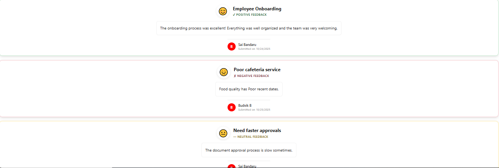

# Feedback Sentiment Board

This sample uses **SharePoint List Formatting** to visualize feedback sentiment (Positive, Neutral, Negative) with **keyword-based detection** in a color-coded and emoji-enhanced card view.  
Each feedback item is automatically analyzed for sentiment keywords and displayed as a beautiful card showing the sentiment icon, feedback text, author details, and submission date.

## Summary

- **Automatic sentiment detection** based on keywords in feedback text
- **Color-coded cards** with gradient backgrounds (Green for positive, Red for negative, Yellow for neutral)
- **Emoji indicators** (😊 😞 😐) displayed in circular badges
- **Status** showing POSITIVE/NEGATIVE/NEUTRAL
- **Author avatars** with initials in gradient circles
- **Modern card layout** with shadows and rounded corners
- Perfect for **HR feedback forms**, customer surveys, and employee pulse checks

## View Requirements

Create a list with the following columns:

| Internal Name   | Type                        | Description                           |
|-----------------|-----------------------------|---------------------------------------|
| **Title**       | Single line of text         | Feedback title or category            |
| **Feedback**    | Multiple lines of text      | The actual feedback content           |
| **Author**      | Person or Group             | Person who submitted the feedback     |
| **Created**     | Date and Time               | Submission date (auto-generated)      |

**Note:** If your Author column has a different internal name, update `[$Author0]` in the JSON to match your column name (e.g., `[$Author]`).

## Sentiment Keywords

### Positive Keywords (😊 Green):
excellent, great, amazing, love, fantastic, wonderful, outstanding, perfect, impressed, exceptional

### Negative Keywords (😞 Red):
poor, bad, terrible, worst, hate, awful, horrible, frustrated, disappointing

### Neutral (😐 Yellow):
Any feedback without the above keywords

## Sample Data

| Title                    | Feedback                                                                                      | Author             | Created              |
|--------------------------|-----------------------------------------------------------------------------------------------|--------------------|----------------------|
| Employee Onboarding      | The onboarding process was excellent! Everything was well organized and the team was welcoming. | Sai Bandaru         | 2025-10-24T06:17:08Z |
| Need faster approvals      | The document approval process is slow sometimes.           | Budvik B      | 2025-10-25T08:30:00Z |
| Poor cafeteria service       | Food quality has bad in recent days.          | Sai Bandaru       | 2025-10-25T14:45:00Z |

## Sample

Solution|Author(s)
--------|---------
feedback-sentiment-board.json | [Sai Bandaru](https://github.com/saiiiiiii)

## Version history

Version|Date|Comments
-------|----|--------
1.0|October 25, 2025|Initial release

## Disclaimer
**THIS CODE IS PROVIDED *AS IS* WITHOUT WARRANTY OF ANY KIND, EITHER EXPRESS OR IMPLIED, INCLUDING ANY IMPLIED WARRANTIES OF FITNESS FOR A PARTICULAR PURPOSE, MERCHANTABILITY, OR NON-INFRINGEMENT.**

---

## Additional Notes

- **Keyword detection is case-insensitive** - works with any capitalization
- You can easily add more keywords by extending the `indexOf()` conditions in the JSON
- The sentiment is determined by the **first matching keyword** found in the feedback text

