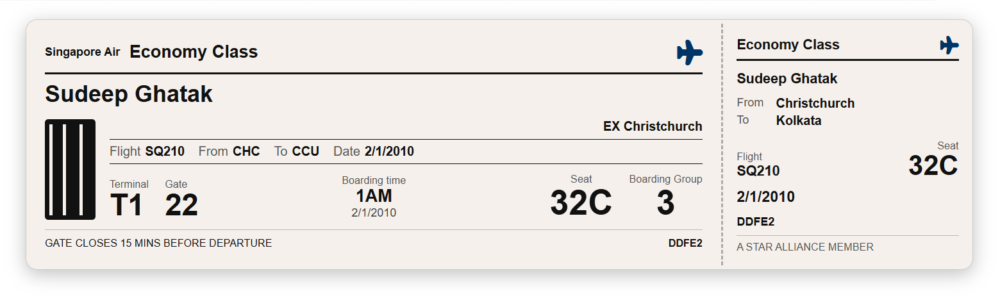

# Flight Boarding Card

## Summary

This SharePoint JSON view formatting sample transforms list items into realistic flight boarding cards. Each card mimics a physical airline boarding pass with a main ticket section and a tear-off stub, displaying passenger name, flight details, seat, terminal, gate, boarding time, and boarding group.

## View requirements

### Recommended SharePoint List Columns

| Column Name       | Internal Name  | Type                | Description                                      |
| ----------------- | -------------- | ------------------- | ------------------------------------------------ |
| Title             | Title          | Single line of text | Passenger full name (e.g. CHAKRABORTY DONA)      |
| Airline           | Airline        | Single line of text | Airline name (e.g. SINGAPORE AIRLINES)           |
| Travel Class      | TravelClass    | Choice              | Cabin class (Economy Class, Business Class, etc) |
| Flight Number     | FlightNumber   | Single line of text | Flight number (e.g. SQ 295)                      |
| Departure Code    | DepartureCode  | Single line of text | 3-letter IATA departure airport code (e.g. SIN)  |
| Departure City    | DepartureCity  | Single line of text | Departure city name (e.g. SINGAPORE)             |
| Arrival Code      | ArrivalCode    | Single line of text | 3-letter IATA arrival airport code (e.g. CHC)    |
| Arrival City      | ArrivalCity    | Single line of text | Arrival city name (e.g. CHRISTCHURCH)            |
| Flight Date       | FlightDate     | Single line of text | Flight date formatted as DDMMMYY (e.g. 30JAN26)  |
| Boarding Time     | BoardingTime   | Single line of text | Boarding time (e.g. 08:00 AM)                    |
| Seat              | Seat           | Single line of text | Seat number (e.g. 60D)                           |
| Boarding Group    | BoardingGroup  | Number              | Boarding group number (e.g. 4)                   |
| Terminal          | Terminal       | Single line of text | Departure terminal (e.g. 3)                      |
| Gate              | Gate           | Single line of text | Departure gate (e.g. B12)                        |
| Issued From       | IssuedFrom     | Single line of text | City code where ticket was issued (e.g. DEL)     |
| Booking Reference | BookingRef     | Single line of text | Booking/PNR reference number (e.g. 00105)        |

A PowerShell script has been provided in the [assets](./assets/Create%20List.ps1) folder to provision the list for you.

**Note:** This script uses [PnP PowerShell](https://pnp.github.io/powershell/) and requires an environment ready for PnP PowerShell.

## Sample

Solution|Author
--------|---------
boarding-card.json | [Sudeep Ghatak](https://github.com/sudeepghatak) ([LinkedIn](https://www.linkedin.com/in/sudeepghatak/))

## Version history

Version|Date|Comments
-------|----|--------
1.0|March 14, 2026|Initial release

## Disclaimer

**THIS CODE IS PROVIDED *AS IS* WITHOUT WARRANTY OF ANY KIND, EITHER EXPRESS OR IMPLIED, INCLUDING ANY IMPLIED WARRANTIES OF FITNESS FOR A PARTICULAR PURPOSE, MERCHANTABILITY, OR NON-INFRINGEMENT.**

---

## Additional notes

- The **Title** column is used as the passenger name.
- **FlightDate** is stored as text in `DDMMMYY` format (e.g. `30JAN26`) to match the printed style on a real boarding pass.
- The **IssuedFrom** field renders as `EX <city code>` on the card (e.g. `EX DEL`). Leave blank if not applicable.
- The "GATE CLOSES 15 MINS BEFORE DEPARTURE" message is static and always displayed.

