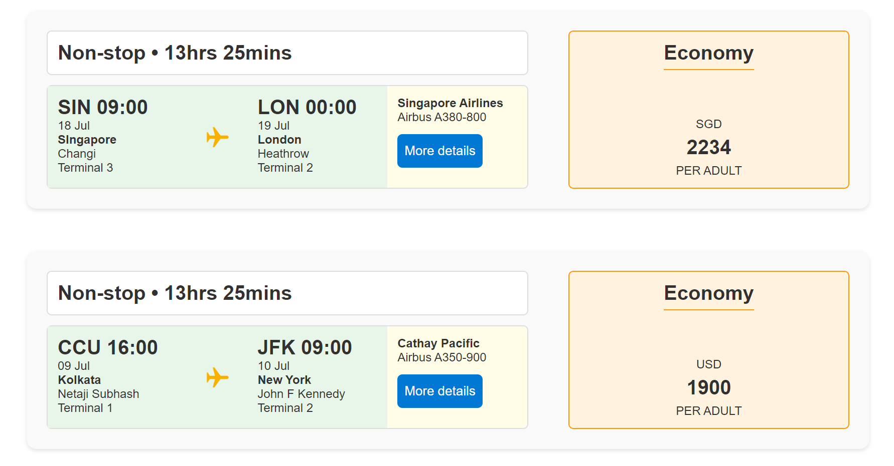

# Flight Card

## Summary

This sample transforms list items into cards formatted with flight information layouts. To ensure the view functions correctly, make sure all specified columns are included. The icons are referenced from [Fluent UI Icons](https://developer.microsoft.com/en-us/fluentui#/styles/web/icons).

## View requirements

Column Name                 | Type
----------------------------|-----------------------------------------
Title                       | Single line of text
From                        | Single line of text
To                          | Single line of text
SourceTime                  | Date and Time
DestinationTime             | Date and Time
Source Airport              | Single line of text
Destination Airport         | Single line of text
SourceTerminal              | Single line of text
DestinationTerminal         | Single line of text
Airline                     | Single line of text
FlightNo                    | Single line of text
Carrier                     | Single line of text
Class                       | Choice (Economy,Business,Premium Economy)
Currency                    | Single line of text
Price                       | Number
PriceLabel                  | Single line of text
SourceCode                  | Single line of text
DestinationCode             | Single line of text
SourceTimeOnly              | Calculated (`=TEXT([SourceTime],"HH:mm")`) (Single line of text)
DestinationTimeOnly         | Calculated (`=TEXT([DestinationTime],"dd mmm")`) (Single line of text)
FormattedSourceDate         | Calculated (`=TEXT([SourceTime],"HH:mm")`) (Single line of text)
FormattedDestinationDate    | Calculated (`=TEXT([DestinationTime],"dd mmm")`) (Single line of text)

> [!NOTE]  
> This sample uses a [Calculated column](https://learn.microsoft.com/previous-versions/office/developer/sharepoint-2010/bb862071(v=office.14)). Note that the separator for a Calculated column is either a `,` (comma) or a `;` (semi-colon), depending on the locale. If your locale uses `;` as the separator, please replace `,` with `;` in the formulas above.

## Sample

Solution|Author
--------|---------
flight-card.json | [Sudeep Ghatak](https://github.com/sudeepghatak)

## Version history

Version|Date|Comments
-------|----|--------
1.0|July 22, 2024|Initial release

## Disclaimer
**THIS CODE IS PROVIDED *AS IS* WITHOUT WARRANTY OF ANY KIND, EITHER EXPRESS OR IMPLIED, INCLUDING ANY IMPLIED WARRANTIES OF FITNESS FOR A PARTICULAR PURPOSE, MERCHANTABILITY, OR NON-INFRINGEMENT.**

---

## Additional notes

None

