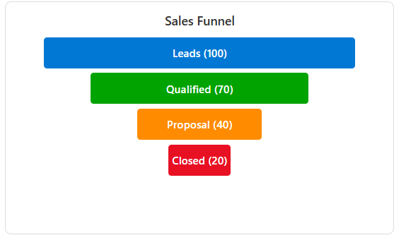

# Funnel Chart – SharePoint List Tile JSON Formatter

This sample demonstrates how to render a **Funnel Chart** inside a **Tile card style view** in SharePoint.

The funnel chart is useful for visualizing pipeline stages such as **Leads → Qualified → Proposal → Closed**, with stage widths proportional to numeric values.

## What You'll Need

Before starting, ensure you have:
- **SharePoint Online** access with list creation permissions
- A **Custom List** (we'll create this together)

## Step 1: Create Your SharePoint List

1. **Navigate to your SharePoint site**
2. **Click "New"** → **"List"**
3. **Select "Blank list"**
4. **Name your list** (e.g., "Sales Funnel Dashboard")
5. **Click "Create"**

## Step 2: Add Required Columns

You need to add these columns to your newly created list:

### Add Each Column:
1. **Click "Add column"** in your list
2. **Select the column type** from the table below
3. **Enter the column name** exactly as shown
4. **Click "Save"**

| Column Name    | Type              | Notes |
|----------------|-------------------|-------|
| **Title**      | Single line text  | Already exists by default |
| **Stage1**     | Number            | First stage value |
| **Stage1Label**| Single line text  | First stage name |
| **Stage1Color**| Single line text  | First stage color (hex code) |
| **Stage2**     | Number            | Second stage value |
| **Stage2Label**| Single line text  | Second stage name |
| **Stage2Color**| Single line text  | Second stage color (hex code) |
| **Stage3**     | Number            | Third stage value |
| **Stage3Label**| Single line text  | Third stage name |
| **Stage3Color**| Single line text  | Third stage color (hex code) |
| **Stage4**     | Number            | Fourth stage value |
| **Stage4Label**| Single line text  | Fourth stage name |
| **Stage4Color**| Single line text  | Fourth stage color (hex code) |

## Step 3: Add Sample Data

**Add a test item** to see your funnel chart:

1. **Click "New"** in your list
2. **Fill in these sample values:**
   - **Title:** Sales Funnel Q3
   - **Stage1:** 100, **Stage1Label:** Leads, **Stage1Color:** #0078d4
   - **Stage2:** 75, **Stage2Label:** Qualified, **Stage2Color:** #00a300
   - **Stage3:** 45, **Stage3Label:** Proposal, **Stage3Color:** #ff8c00
   - **Stage4:** 25, **Stage4Label:** Closed, **Stage4Color:** #e81123
3. **Click "Save"**

## Step 4: Apply the Funnel Chart Formatting

### Create and Format the View:
1. **Click the view dropdown** (next to "All Items")
2. **Select "Create new view"**
3. **Choose "Gallery"** layout
4. **Name your view** "Funnel Chart View"
5. **Click "Create"**
6. **Click the Funnel Chart View dropdown**
7. **Click "Format current view"**
8. **Click "Advanced mode"**
9. **Copy the entire JSON code** from the `funnel-chart-tile.json` file
10. **Paste it** into the formatting panel
11. **Click "Preview"** to see your funnel chart
12. **Click "Save"** to apply the formatting

## Troubleshooting

**Funnel not showing?**
- Verify all required columns exist
- Check that your sample data has numeric values in Stage columns
- Ensure you're in Tiles view layout

**Stages too narrow?**
- Increase the numeric values in your stage columns
- The width is calculated as: Stage Value × 4 pixels

**Colors not working?**
- Use proper hex color format: #000000
- Avoid color names like "red" or "blue"

## Sample

| File | Author |
|------|---------|
| funnel-chart-tile.json | [Sai Bandaru](https://github.com/saiiiiiii) ([LinkedIn](https://www.linkedin.com/in/sai-bandaru-97a946153/)) |

## Version History

| Version | Date | Comments |
|---------|------|----------|
| 1.0 | Sep 04, 2025 | Initial release |

## Disclaimer
**THIS CODE IS PROVIDED *AS IS* WITHOUT WARRANTY OF ANY KIND, EITHER EXPRESS OR IMPLIED, INCLUDING ANY IMPLIED WARRANTIES OF FITNESS FOR A PARTICULAR PURPOSE, MERCHANTABILITY, OR NON-INFRINGEMENT.**

