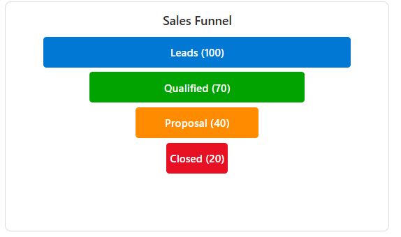

# Funnel Chart – SharePoint List Tile JSON Formatter

This sample demonstrates how to render a **Funnel Chart** inside a **Tile card style view** in SharePoint.

The funnel chart is useful for visualizing pipeline stages such as **Leads → Qualified → Proposal → Closed**, with stage widths proportional to numeric values.

---

## Prerequisites

Create a **Custom List** with the following columns:

| Column Name    | Type              | Example Value |
|----------------|-------------------|---------------|
| **Title**      | Single line text  | Sales Funnel |
| **Stage1**     | Number            | 100 |
| **Stage1Label**| Single line text  | Leads |
| **Stage1Color**| Single line text  | #0078d4 |
| **Stage2**     | Number            | 70 |
| **Stage2Label**| Single line text  | Qualified |
| **Stage2Color**| Single line text  | #00a300 |
| **Stage3**     | Number            | 40 |
| **Stage3Label**| Single line text  | Proposal |
| **Stage3Color**| Single line text  | #ff8c00 |
| **Stage4**     | Number            | 20 |
| **Stage4Label**| Single line text  | Closed |
| **Stage4Color**| Single line text  | #e81123 |

> You can add more stages if needed by extending the JSON.

---

## Installation

### Create and Format the View:
1. **Click the view dropdown** (next to "All Items")
2. **Select "Create new view"**
3. **Choose "Tiles"** layout
4. **Name your view** "Funnel Chart View"
5. **Click "Create"**
6. **Click the Funnel Chart View dropdown**
7. **Click "Format current view"**
8. **Click "Advanced mode"**
9. **Copy the entire JSON code** from the `funnel-chart-tile.json` file
10. **Paste it** into the formatting panel
11. **Click "Preview"** to see your funnel chart
12. **Click "Save"** to apply the formatting

### Sample

Solution|Author
--------|---------
funnel-chart-tile.json | [Sai Bandaru](https://github.com/saiiiiiii) ([LinkedIn](https://www.linkedin.com/in/sai-bandaru-97a946153/))

## Version history

Version|Date|Comments
-------|----|--------
1.0|Sep 04, 2025|Initial release

## Disclaimer
**THIS CODE IS PROVIDED *AS IS* WITHOUT WARRANTY OF ANY KIND, EITHER EXPRESS OR IMPLIED, INCLUDING ANY IMPLIED WARRANTIES OF FITNESS FOR A PARTICULAR PURPOSE, MERCHANTABILITY, OR NON-INFRINGEMENT.**