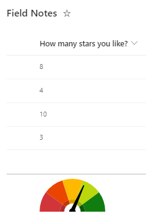

# Gauge Aggregate Footer

## Summary

This sample shows a gauge in the list footer (when aggregates are enabled).

## View requirements

|Type|Internal Name|Required|
|---|---|:---:|
|Number|any|Yes|

This format can be applied to any list where a column has an aggregate function (ie sum, average, etc.).

The format assumes a value between 0 and 10 (and is converting to a percentage). To change the total, you can do a find and replace to change the expression. For instance you can find all instances of `(@columnAggregate.value)/10` and replace with `(@columnAggregate.value)/100` if the range is 0-100. If using a number stored as a percent you can simply replace the `(@columnAggregate.value)/10` with `@columnAggregate.value`.

> By default, this format will be applied to ALL aggregate columns. To filter only to a specific field, add a check for the `@columnAggregate.columnDisplayName` and hide accordingly.

## Sample

Solution|Author(s)
--------|---------
gauge-aggregate-footer.json | [Chris Kent](https://github.com/thechriskent)

## Version history

Version|Date|Comments
-------|----|--------
1.0|April 4, 2022|Initial release

## Disclaimer

**THIS CODE IS PROVIDED *AS IS* WITHOUT WARRANTY OF ANY KIND, EITHER EXPRESS OR IMPLIED, INCLUDING ANY IMPLIED WARRANTIES OF FITNESS FOR A PARTICULAR PURPOSE, MERCHANTABILITY, OR NON-INFRINGEMENT.**

---

## Additional notes
None

