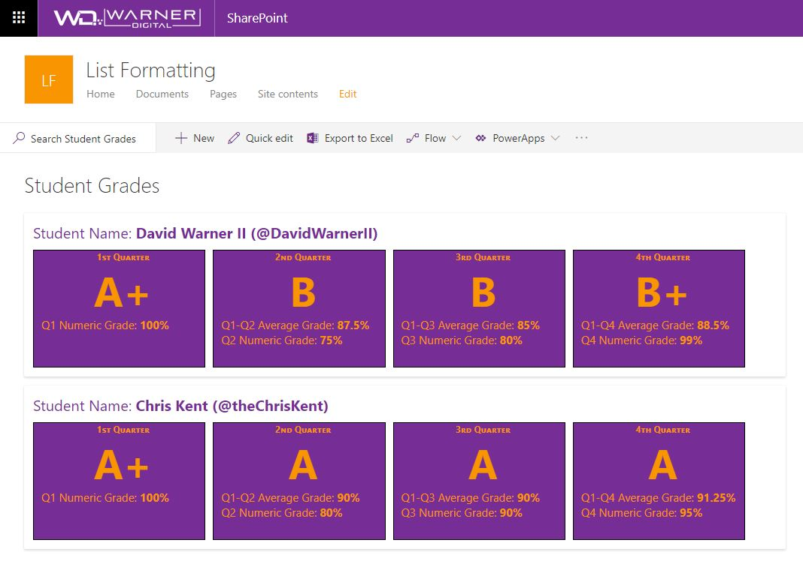
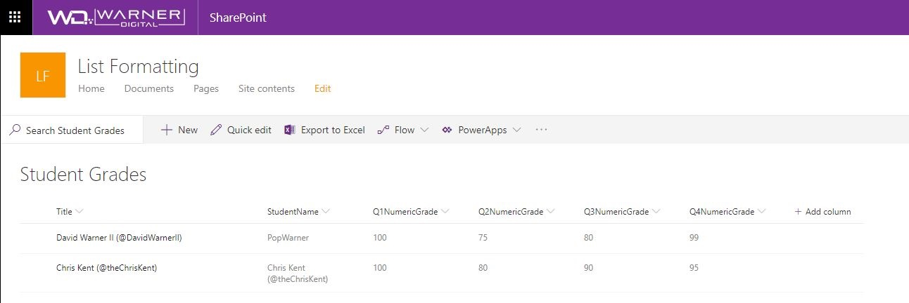

# Numeric Average Comparison

## Summary
Provides an example of comparing numeric values across time periods. In this example, we are using grades for students across 4 quarters, though the principle can be applied to any repetitive numeric values.

The View Formatting definition calculates the average of the current and prior quarters numeric grades. The current quarter numeric grade and the average of the previous quarters is displayed. (Example: Quarter 3 calculates the average of quarter 1, 2 & 3)

In addition to the numeric average calculation displayed within each quarter, this example also illustrates how the average value in each quarter can be used to assign additional labels, such as the Student Grade. (Example: A,B,C,D,F)

## View requirements

|Type|Internal Name|Required|
|---|---|:---:|
|Single line of text|Title|Yes|
|Single line of text|StudentName|No|
|Number|Q1NumericGrade|Yes|
|Number|Q2NumericGrade|Yes|
|Number|Q3NumericGrade|Yes|
|Number|Q4NumericGrade|Yes|

## Sample

Solution|Author(s)
--------|---------
generic-numeric-average-comparison.json | [David Warner II](https://github.com/PopWarner) ([@DavidWarnerII](https://twitter.com/davidwarnerii))

## Version history

Version|Date|Comments
-------|----|--------
1.0|November 7, 2018|Initial release

## Disclaimer
**THIS CODE IS PROVIDED *AS IS* WITHOUT WARRANTY OF ANY KIND, EITHER EXPRESS OR IMPLIED, INCLUDING ANY IMPLIED WARRANTIES OF FITNESS FOR A PARTICULAR PURPOSE, MERCHANTABILITY, OR NON-INFRINGEMENT.**

---

## Additional notes

Using the `customRowAction` with an `action` of `defaultClick` creates a great way to make your list into a master view with details easily accessible. This sample wraps the entire row in a button so that you can click anywhere in the row to open the information panel for the item:

