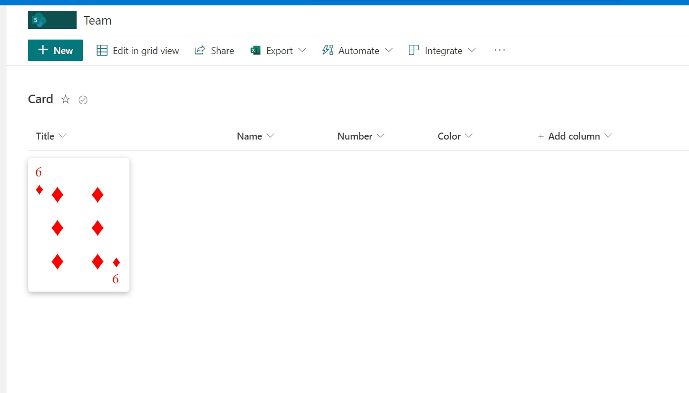

# Numeric card format

## Summary
This sample display formatted number column as playing card. 

## View requirements
- The format expect the following fields:

Field |Type
--------|---------
Title | Single line of text.
Name | Choice - Default values (♠️,♥,♣,♦)
Number | Number - Limit values between Min. 1 and Max. 10.
Color | Single line of text - Color name or hex number.

## Sample

Solution|Author(s)
--------|---------
numeric-card-format.json | [André Lage](https://twitter.com/aaclage)

## Version history

Version|Date|Comments
-------|----|--------
1.0|April 22, 2022|Initial release

## Disclaimer
**THIS CODE IS PROVIDED *AS IS* WITHOUT WARRANTY OF ANY KIND, EITHER EXPRESS OR IMPLIED, INCLUDING ANY IMPLIED WARRANTIES OF FITNESS FOR A PARTICULAR PURPOSE, MERCHANTABILITY, OR NON-INFRINGEMENT.**

