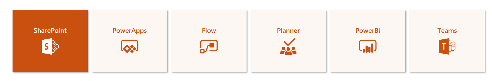

# Items in Tile Format

## Summary
This sample uses rowFormatter element to overrides the default formatting on the view.  This view allow users to use the list as the promoted links app (including the power the security trimming on the items).  This sample uses the Icons from the Microsoft UI Fabric. The name of the icon is referenced through an Icon field.

This format takes advantage of the `tileProps` property to create tiles in the Tiles display for the view. To see the tiles, switch your view to the Tiles display.

## View requirements
- The format expect the following fields:

Field |Type
--------|---------
Title | Single line of text 
Icon | Single line of text
URL | Hyperlink 
NewTab | Yes/No - This field is used to open the link the same tab or new tab

The size of the tile can be adjusted by chaing the width and height values.

## Sample

Solution|Author(s)
--------|---------
title-view.json | [S Merchant](https://twitter.com/sohailmerchant)

## Version history

Version|Date|Comments
-------|----|--------
1.0|Septmeber 9, 2018|Initial release
2.0|September 5, 2019|Utilizes tileProps

## Disclaimer
**THIS CODE IS PROVIDED *AS IS* WITHOUT WARRANTY OF ANY KIND, EITHER EXPRESS OR IMPLIED, INCLUDING ANY IMPLIED WARRANTIES OF FITNESS FOR A PARTICULAR PURPOSE, MERCHANTABILITY, OR NON-INFRINGEMENT.**

