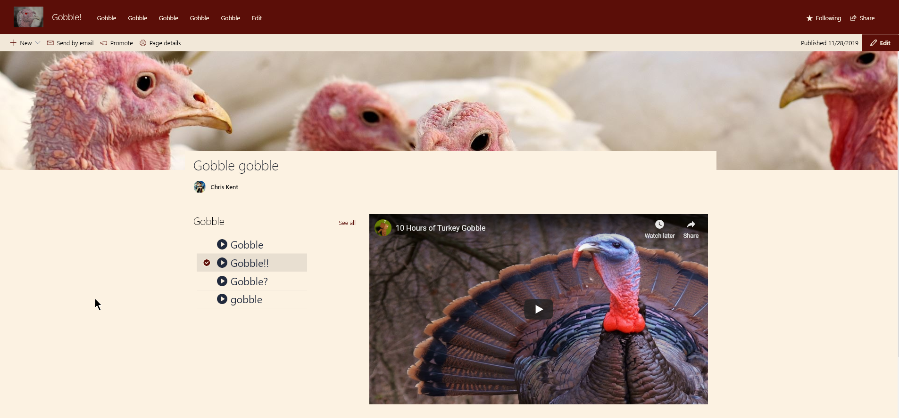

# Video Button

## Summary
This sample demonstrates the use of dynamic connections in the list webpart while using a custom format. The format is applied to a list of YouTube videos with each item containing the shortcode for the video. On a page, the list webpart with the custom view is used. The embed webpart is configured to accept it as a connection. This results in a custom video selection application that changes the embeded video on the page.



### Page Configuration

1. Add the list webpart to a modern page and set the view to use the formatted view. Optionally, hide the commandbar and see all link.
1. Add an Embed webpart to the page and connect to a source. In this case, choose the list webpart we just put on the page.
1. In the embed code paste the standard embed code for YouTube Videos replacing the shortcode with the internal name of your column in the format `[$INTERNALNAME]` (`[$Gobble] in the code below)

```
<iframe width="560" height="315" src="https://www.youtube.com/embed/[$Gobble]" frameborder="0" allow="accelerometer; autoplay; encrypted-media; gyroscope; picture-in-picture" allowfullscreen=""></iframe>
```


Now, when you select an item in the list webpart you should see the related video show up in the embed webpart!

## View requirements

|Type|Internal Name|Required|
|---|---|:---:|
|Single line of text|Title|Yes|
|Single line of text|Gobble|Yes|

The Gobble column above is where the YouTube shortcode goes. Both the Title and the Gobble column should be part of the view.

## Sample

Solution|Author(s)
--------|---------
generic-video-button.json | [Chris Kent](https://twitter.com/theChrisKent)

## Version history

Version|Date|Comments
-------|----|--------
1.0|March 31, 2020|Initial release

## Disclaimer
**THIS CODE IS PROVIDED *AS IS* WITHOUT WARRANTY OF ANY KIND, EITHER EXPRESS OR IMPLIED, INCLUDING ANY IMPLIED WARRANTIES OF FITNESS FOR A PARTICULAR PURPOSE, MERCHANTABILITY, OR NON-INFRINGEMENT.**

---


