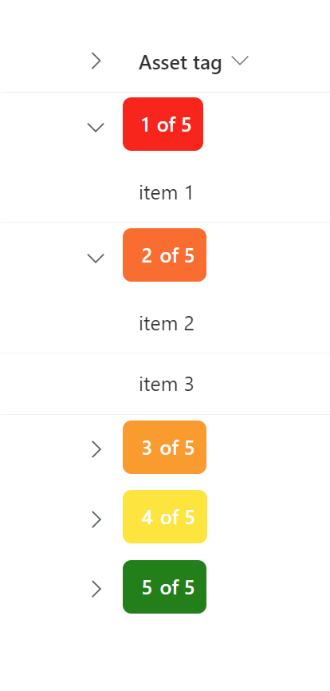

# Group Header color change depending on amount of items grouped

## Summary
This is a sample of customizing the group header by showing a color code that changes depending on the amount of items in the group:

- Less then 5 items shows the header as red, yellow, etc
- Exactly 5 items shows the header as green

The header will also show "x of 5", with x being the amount of items in the group.

## View requirements

Group by a column of choice.

## Sample

Solution|Author(s)
--------|---------
group-header-color-itemcount.json | [Marijnsomers](https://github.com/marijnsomers)

## Version history

Version |Date          |Comments
--------|--------------|--------------------------------
1.0     |February 20, 2023 |Initial release

## Disclaimer
**THIS CODE IS PROVIDED *AS IS* WITHOUT WARRANTY OF ANY KIND, EITHER EXPRESS OR IMPLIED, INCLUDING ANY IMPLIED WARRANTIES OF FITNESS FOR A PARTICULAR PURPOSE, MERCHANTABILITY, OR NON-INFRINGEMENT.**

---

## Additional notes

- None

