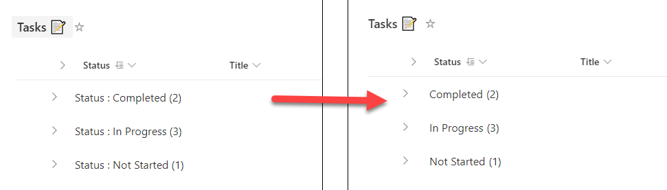

# Remove column name from group header

## Summary

This view formatting sample can be used to customize the group header to remove column name from group header.

This sample contains two JSON files, one in which the group header is clickable (`group-header-remove-column-name-clickable.json`) and one in which it is not (`group-header-remove-column-name.json`). If you apply `group-header-remove-column-name-clickable.json` and click on a group header, you will see the view filtered by the value of the group header you clicked on.

## View requirements

List view with Group by applied on any column in the view.

## Sample

Solution|Author(s)
--------|---------
group-header-remove-column-name.json | [Ganesh Sanap](https://github.com/ganesh-sanap) ([@GaneshSanap20](https://twitter.com/GaneshSanap20))
group-header-remove-column-name-clickable.json | [Ganesh Sanap](https://github.com/ganesh-sanap) ([@GaneshSanap20](https://twitter.com/GaneshSanap20)) & [Tetsuya Kawahara](https://github.com/tecchan1107) ([@techan_k](https://twitter.com/techan_k))

## Version history

Version |Date          |Comments
--------|--------------|--------------------------------
1.0     |November 10, 2021 |Initial release
1.1     |October 17, 2023 |Added group-header-remove-column-name-clickable.json

## Disclaimer

**THIS CODE IS PROVIDED *AS IS* WITHOUT WARRANTY OF ANY KIND, EITHER EXPRESS OR IMPLIED, INCLUDING ANY IMPLIED WARRANTIES OF FITNESS FOR A PARTICULAR PURPOSE, MERCHANTABILITY, OR NON-INFRINGEMENT.**

