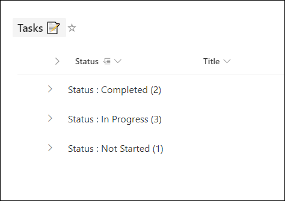
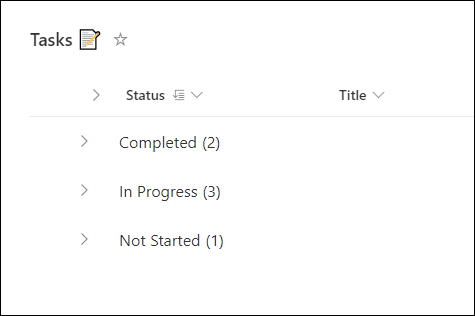

# Remove column name from group header

## Summary

This view formatting sample can be used to customize the group header to remove column name from group header.

**Before applying view formatting**:

**After applying view formatting**:

## View requirements

List view with Group by applied on any column in the view.

## Sample

Solution                       |Author(s)
-------------------------------|---------------------------
group-header-remove-column-name.json |[Ganesh Sanap](https://twitter.com/GaneshSanap20)

## Version history

Version |Date          |Comments
--------|--------------|--------------------------------
1.0     |November 10, 2021 |Initial release

## Disclaimer

**THIS CODE IS PROVIDED *AS IS* WITHOUT WARRANTY OF ANY KIND, EITHER EXPRESS OR IMPLIED, INCLUDING ANY IMPLIED WARRANTIES OF FITNESS FOR A PARTICULAR PURPOSE, MERCHANTABILITY, OR NON-INFRINGEMENT.**

