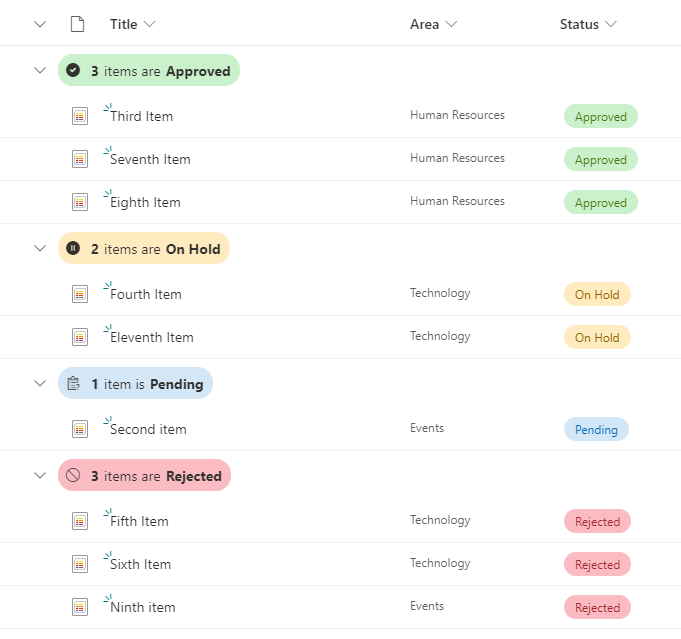

# Group Header Status Icon and Color

## Summary
This is a sample of customizing the group header when grouping by a Status column. This format displays a different color and icon according to the Status.

Also changes labeling according to being only one item or more:

- 1 item is 'Status'
- X items are 'Status'

> This format only affects the group header, the Status column in the screenshot above is using the out of the box pill formatting.

## View requirements

Group by a Status Choice column and display that choice column in the view.

Choice values managed for the status choice column in this sample:

- Pending
- Approved
- Rejected
- On Hold

## Sample

Solution|Author(s)
--------|---------
group-header-status-icon-color.json | [Michel Mendes](https://github.com/michelcarlo)

## Version history

Version |Date          |Comments
--------|--------------|--------------------------------
1.0     |October 26, 2021 |Initial release

## Disclaimer
**THIS CODE IS PROVIDED *AS IS* WITHOUT WARRANTY OF ANY KIND, EITHER EXPRESS OR IMPLIED, INCLUDING ANY IMPLIED WARRANTIES OF FITNESS FOR A PARTICULAR PURPOSE, MERCHANTABILITY, OR NON-INFRINGEMENT.**
##

