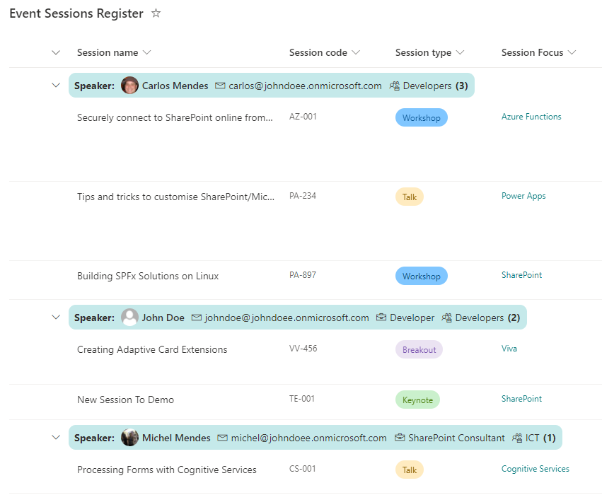

# Display User Properties in the Group Header

## Summary
This sample demonstrates showing additional properties for a grouped user field in the group header. The user's picture, email, title, and department are all shown.

If any property is empty, its respective icon and label are not displayed.

## View requirements

|Type |Internal Name|Required|Details|
|---|---|:---:|---|
|Person or Group|Any|Yes|Create a view, add the desired person field and group the view by this person field.

## Sample

Solution|Author(s)
--------|---------
group-header-user-properties.json | [Michel Mendes](https://github.com/michelcarlo)

## Version history

Version |Date          |Comments
--------|--------------|--------------------------------
1.0     |November 28, 2021 |Initial release

## Disclaimer
**THIS CODE IS PROVIDED *AS IS* WITHOUT WARRANTY OF ANY KIND, EITHER EXPRESS OR IMPLIED, INCLUDING ANY IMPLIED WARRANTIES OF FITNESS FOR A PARTICULAR PURPOSE, MERCHANTABILITY, OR NON-INFRINGEMENT.**
##

