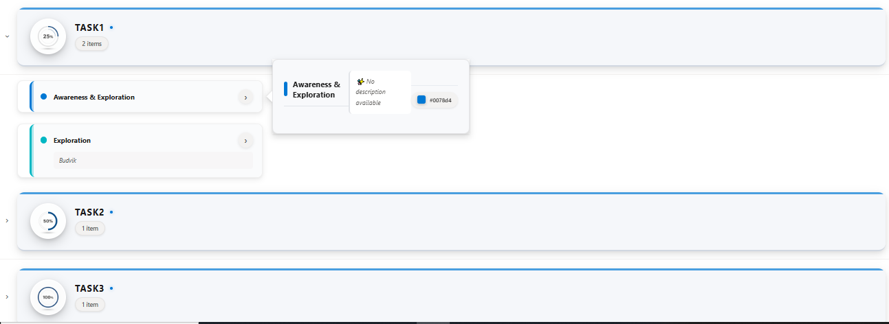

# Grouped Accordion View with Enhanced Styling

This sample uses **SharePoint List Formatting** to display list items grouped by TaskTitle with a modern, card-based design featuring:
- Elegant group headers with TaskTitle images and item counts
- Color-coded item cards with visual indicators
- Interactive hover cards showing detailed information
- Smooth modern styling



## View Requirements

### Column Requirements

Create a list with the following columns:

| Internal Name    | Type                          | Description                                    |
|------------------|-------------------------------|------------------------------------------------|
| **Title**        | Single line of text           | Item title                                     |
| **Description**  | Multiple lines of text        | Item description (optional)                    |
| **ColorCode**    | Single line of text           | Hex color code for visual theming (e.g., #0078d4) |
| **TaskTitle**     | Lookup                        | Lookup column to TaskTitle list               |

### TaskTitle List Setup

Create a separate **TaskTitle** list with the following columns:

| Internal Name | Type                |
|---------------|---------------------|
| **Title**     | Single line of text |
| **ImageUrl**     | Single line of text |
| **TaskTitle**     | Calculated (calculation based on other columns) |

**Important:** The TaskTitle lookup column must be configured to show additional fields. The lookup value should be formatted as:
```
=CONCATENATE(Title,"&+&",ImageUrl,"&++&")
```

For example: `Title&+&https://example.com/icon.png&++&`

## Sample Data

### TaskTitle List

| Title       | Image                                    |
|-------------|------------------------------------------|
| Task1 | https://example.com/images/icon.png  |
| Task2          | https://example.com/images/icon2.png   |
| Task3      | https://example.com/images/icon3.png|

### Main List

| Title              | Description                          | ColorCode | TaskTitle    |
|--------------------|--------------------------------------|-----------|-------------|
| Awareness & Exploration    | Build REST API endpoints             | #0078d4   | Task1 |
| Exploration       | Budvik     | #00b7c3   | Task1 |
| Sharepoint       | Sharepoint       | #8764b8   | Task2          |
| Copilot      | Modernize               | #d13438   | Task3      |

## View Configuration

1. **Grouping:** Group the view by the **TaskTitle** column
2. **Group Expansion:** Set groups to be collapsed by default for a cleaner initial view
3. **Sorting:** Sort by TaskTitle (ascending) and then by Title (ascending)

## Features

### Group Headers
- **Profile Images:** TaskTitle images displayed in circular frames with elegant shadows
- **TaskTitle Names:** Bold, uppercase styling with visual separators
- **Item Counts:** Dynamic count badges showing number of items per TaskTitle
- **Modern Design:** Subtle gradients, shadows, and accent borders

### Item Cards
- **Color Coding:** Each item features its ColorCode as a visual indicator
- **Compact Layout:** Essential information displayed in a clean, organized manner
- **Visual Feedback:** Smooth hover effects and background color transitions
- **Description Display:** Optional descriptions shown in styled containers

### Hover Cards
- **Detailed Information:** Comprehensive item details shown on hover
- **Callout Design:** Professional callout with beak pointer
- **Color Indicators:** Visual color swatches showing the item's ColorCode
- **Responsive Layout:** Optimized for various screen sizes

## Styling Features

- **Shadow Effects:** Multi-layered shadows for depth and hierarchy
- **Border Radius:** Consistent 12-16px rounded corners throughout
- **Color Accents:** Strategic use of accent colors and glowing effects
- **Transitions:** Smooth 0.35-0.4s transitions for interactive elements
- **Typography:** Carefully selected font sizes and weights for readability

## Customization

### Modify Card Dimensions
Adjust card width and positioning:
```json
"width": "533px"               // Card width
"left": "61px"                 // Card positioning
```

### Change Hover Behavior
Modify the hover card appearance:
```json
"openOnEvent": "hover"         // Change to "click" for click-to-open
"directionalHint": "rightCenter" // Change callout position
```

## Sample

Solution|Author
--------|---------
grouped-accordion-cards.json | [Sai Bandaru](https://github.com/saiiiiiii) ([LinkedIn](https://www.linkedin.com/in/sai-bandaru-97a946153/))

## Version history

Version|Date|Comments
-------|----|--------
1.0|October 24, 2025|Initial release

## Disclaimer
**THIS CODE IS PROVIDED *AS IS* WITHOUT WARRANTY OF ANY KIND, EITHER EXPRESS OR IMPLIED, INCLUDING ANY IMPLIED WARRANTIES OF FITNESS FOR A PARTICULAR PURPOSE, MERCHANTABILITY, OR NON-INFRINGEMENT.**

---

## Additional Notes

- The format automatically handles missing descriptions with a default message
- ColorCode defaults to #0078d4 if not specified
- Optimal viewing experience with 5-15 items per TaskTitle
- Cards are positioned to work best with standard SharePoint list view widths
- All styling uses modern CSS properties for maximum visual appeal

## Troubleshooting

**Issue:** TaskTitle images not displaying
- **Solution:** Verify the lookup column is configured to show the Image field and that the format matches `Title&+&ImageUrl&++&`

**Issue:** Cards appear misaligned
- **Solution:** Adjust the `left` and `width` properties in the rowFormatter section

**Issue:** Colors not showing
- **Solution:** Ensure ColorCode values are valid hex colors (e.g., #FF5733)

