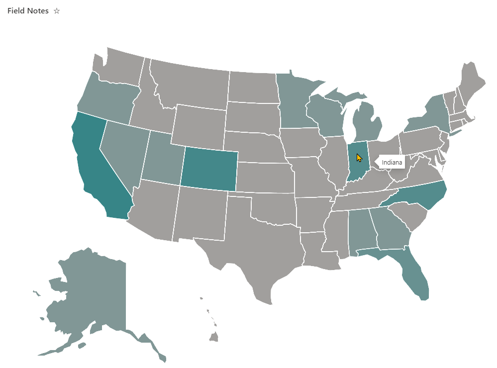
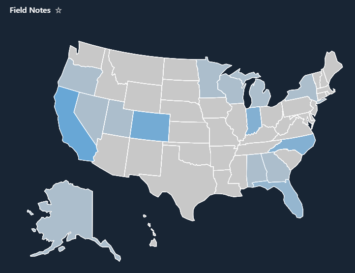

# Heat Map

## Summary

This sample demonstrates creating a layered dynamic SVG image in a view format. States are highlighted when they have list items that correspond to them. They get darker the more times a state is mentioned.

### Theming

This format utilizes theme colors and will adjust correctly as themes change (even dark themes!):

## View requirements

|Type|Internal Name|Required|
|---|---|:---:|
|Single line of text|States|Yes|

> The `States` column can also be a single or multi-choice column with no adjustments needed to the format

## Sample

Solution|Author(s)
--------|---------
heat-map.json | [Chris Kent](https://github.com/thechriskent) ([@thechriskent](https://twitter.com/thechriskent))

## Version history

Version|Date|Comments
-------|----|--------
1.0|April 4, 2022|Initial release

## Disclaimer

**THIS CODE IS PROVIDED *AS IS* WITHOUT WARRANTY OF ANY KIND, EITHER EXPRESS OR IMPLIED, INCLUDING ANY IMPLIED WARRANTIES OF FITNESS FOR A PARTICULAR PURPOSE, MERCHANTABILITY, OR NON-INFRINGEMENT.**

---

## Additional notes
None

